# Tabby Penetration Test Report

## Executive Summary

A black-box penetration test was conducted against the Tabby Linux host hosted on Hack The Box.

The assessment resulted in full compromise of the target system.

Initial reconnaissance identified externally accessible SSH, Apache HTTP and Apache Tomcat services. Web enumeration revealed the Mega Hosting application and a `news.php` endpoint using a user-controlled `file` parameter.

Testing of the `file` parameter confirmed a path traversal / local file inclusion vulnerability. The vulnerability allowed arbitrary local files to be read from the target, including `/etc/passwd` and the Apache Tomcat user configuration file.

The Tomcat configuration disclosed valid management credentials assigned the `admin-gui` and `manager-script` roles. The exposed credentials provided access to Tomcat administrative functionality and allowed a malicious WAR application to be deployed through the Manager text interface.

Execution of the deployed application resulted in a reverse shell as the low-privileged `tomcat` service account.

Post-exploitation enumeration identified a SUID-enabled `pkexec` binary and an outdated PolicyKit package. The host was vulnerable to CVE-2021-4034, commonly known as PwnKit. Exploitation of the vulnerable `pkexec` component successfully elevated privileges from `tomcat` to `root`.

The assessment demonstrated that a web application file-handling weakness, exposed administrative credentials and an unpatched local privilege-escalation vulnerability could be chained together to achieve complete compromise of the system.

---

## Assessment Scope

| Item | Details |
|---|---|
| Target | Tabby |
| Platform | Hack The Box |
| Target IP | 10.129.56.10 |
| Hostname | tabby.htb / megahosting.htb |
| Operating System | Ubuntu Linux |
| Assessment Type | Black-Box Penetration Test |
| Assessment Date | 09 September 2026 |

The objective of the assessment was to identify vulnerabilities and security weaknesses that could allow unauthorized access to the target and determine whether they could be chained to achieve full system compromise.

Testing was performed only against the designated Hack The Box target.

---

## Methodology

The assessment followed a structured penetration-testing methodology consisting of the following phases:

### Reconnaissance

Network and service enumeration was performed to identify exposed ports, services, software versions and web applications.

Tools and techniques included:

- Nmap
- HTTP service inspection
- Directory and content enumeration
- Manual web application review
- Tomcat service inspection

### Vulnerability Identification

Application behavior and exposed functionality were reviewed for weaknesses that could provide unauthorized access.

Particular attention was given to:

- User-controlled file parameters
- Sensitive local file exposure
- Administrative interfaces
- Tomcat management roles
- Local SUID binaries
- Outdated operating system packages

### Exploitation

Confirmed vulnerabilities were exploited in order to obtain an initial foothold on the target.

The vulnerable `file` parameter was used to retrieve sensitive local files, including the Tomcat user configuration.

The recovered Tomcat credentials were then used to access administrative functionality and deploy a WAR application, resulting in a reverse shell as the `tomcat` service account.

### Post-Exploitation Enumeration

Following initial compromise, the system was enumerated for:

- Local users
- SUID binaries
- Installed package versions
- Privilege-escalation opportunities
- Writable filesystem locations
- Operating system information

### Privilege Escalation

Local security configuration and installed software were reviewed to identify a path to administrative privileges.

The SUID-enabled `pkexec` binary and outdated PolicyKit package were identified as vulnerable to CVE-2021-4034.

Successful exploitation ultimately resulted in root-level access.

---

## Risk Rating

Findings were assigned severity ratings based on the potential impact of successful exploitation and the level of access provided.

| Severity | Description |
|---|---|
| Critical | Vulnerabilities that allow complete system compromise, unrestricted remote code execution or immediate root-level access. |
| High | Vulnerabilities that expose sensitive credentials, authentication material or provide significant unauthorized access. |
| Medium | Weaknesses that provide useful information or limited access but generally require additional conditions for major compromise. |
| Low | Minor security weaknesses with limited direct impact. |
| Informational | Observations that do not represent an immediate security vulnerability but may assist defensive improvement. |

---

## Findings Overview

| Finding ID | Finding | Severity |
|---|---|---|
| TB-01 | Path Traversal / Local File Inclusion | High |
| TB-02 | Tomcat Credential Disclosure | High |
| TB-03 | Remote Code Execution Through Tomcat Manager WAR Deployment | Critical |
| TB-04 | PwnKit Local Privilege Escalation (CVE-2021-4034) | Critical |

---

## Compromise Walkthrough

### 1. Initial Reconnaissance

A TCP port scan was performed against the target.

The scan identified the following externally accessible services:

22/tcp    open    ssh  
80/tcp    open    http  
8080/tcp  open    http

Service detection identified Apache HTTP Server on TCP/80 and Apache Tomcat on TCP/8080.

The HTTP service presented the Mega Hosting web application.

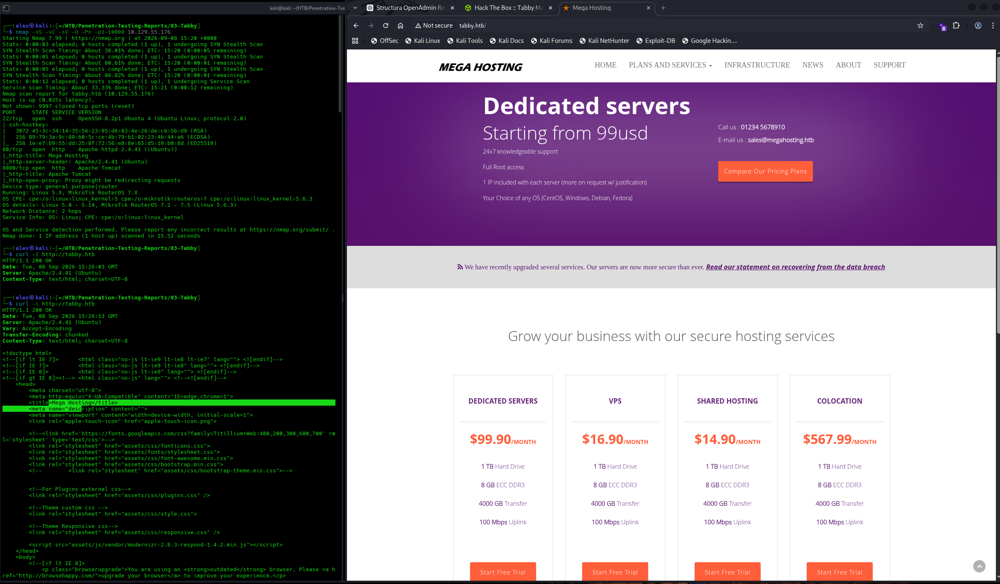

---

### 2. Web Enumeration

Web content enumeration identified several resources on the main HTTP service, including:

/assets/  
/files/  
/index.php  
/news.php  
/Readme.txt

Additional enumeration of TCP/8080 identified Tomcat resources including:

/docs/  
/examples/  
/host-manager/  
/manager/

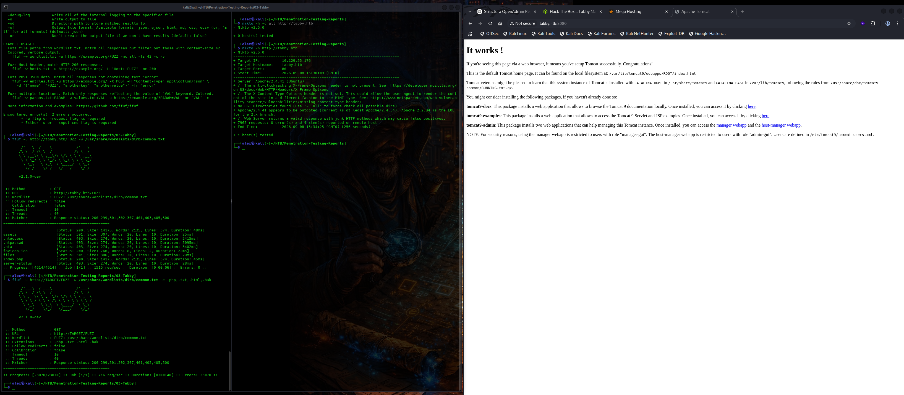

Further inspection confirmed the presence of the Tomcat Manager and Host Manager applications.

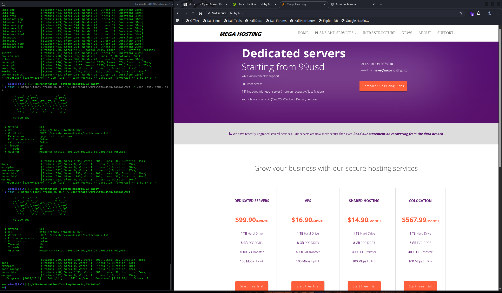

---

### 3. Tomcat Administrative Interface Discovery

The Tomcat Host Manager interface required HTTP authentication.

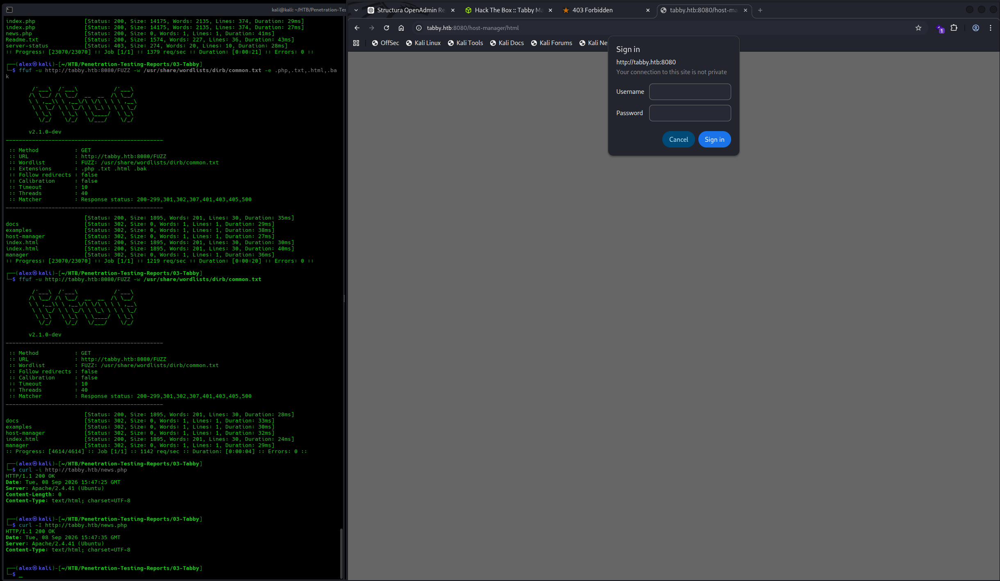

Accessing the management application without valid credentials returned an authorization page containing useful information about Tomcat management roles.

The response referenced the following roles:

manager-gui  
manager-script  
manager-jmx  
manager-status

The page also referenced the `tomcat-users.xml` file used to define Tomcat users and roles.

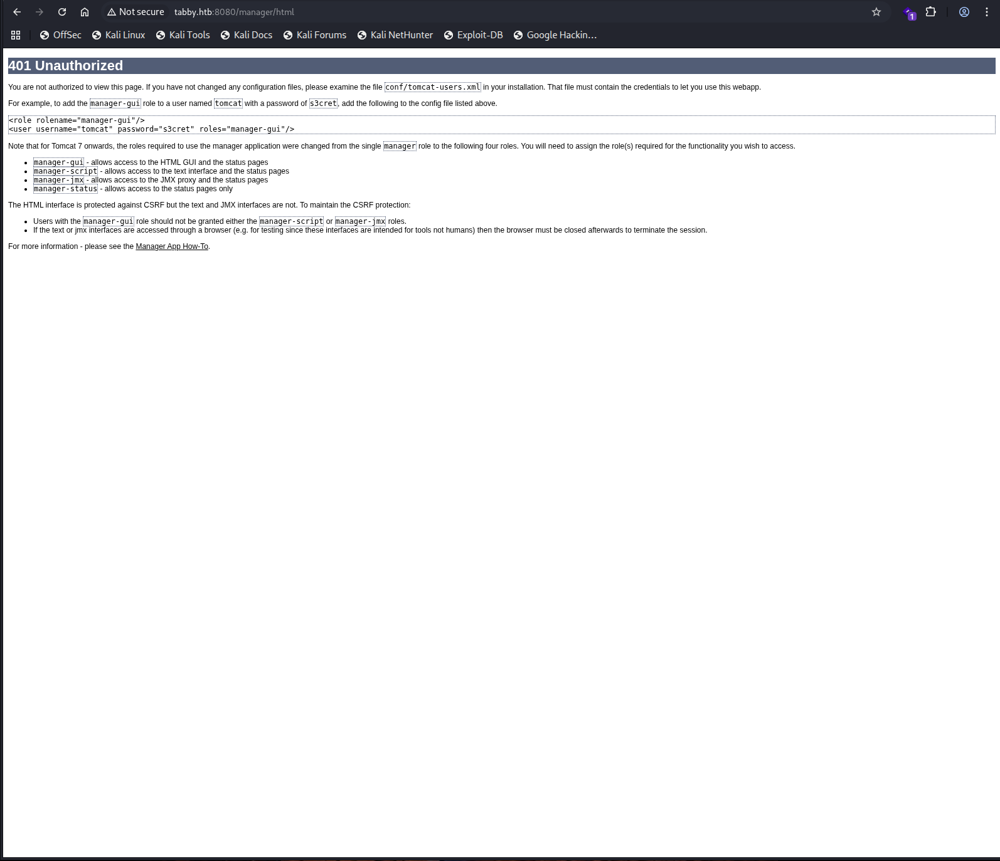

This information later assisted in locating the relevant Tomcat authentication configuration.

---

### 4. File Parameter Discovery

Inspection of the Mega Hosting application revealed a link using the following request pattern:

`news.php?file=statement`

The `file` parameter indicated that server-side content was being selected based on user-controlled input.

The application link and associated parameter were therefore selected for further testing.

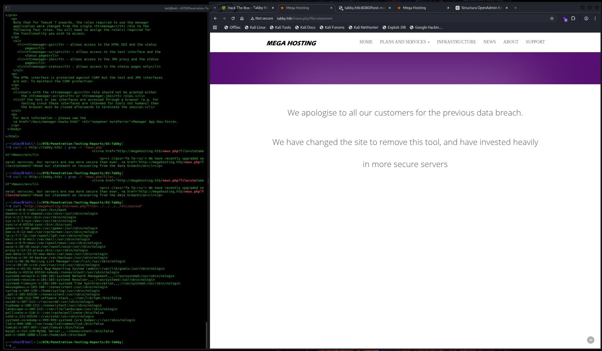

---

### 5. Path Traversal / Local File Inclusion

The `file` parameter was tested using directory traversal sequences.

A request targeting `/etc/passwd` successfully returned the contents of the local system file.

This confirmed that the application allowed arbitrary local file access through path traversal / local file inclusion.

The retrieved `/etc/passwd` file also identified the local user:

`ash`

with the home directory:

`/home/ash`

The vulnerability provided a direct method of reading additional sensitive files accessible to the web application process.

---

### 6. Tomcat Credential Disclosure

After confirming local file access, multiple likely Tomcat configuration paths were tested.

The following file was successfully retrieved:

`/usr/share/tomcat9/etc/tomcat-users.xml`

The configuration contained an active Tomcat account assigned administrative roles including:

`admin-gui`  
`manager-script`

The password value has been intentionally excluded from this public report.

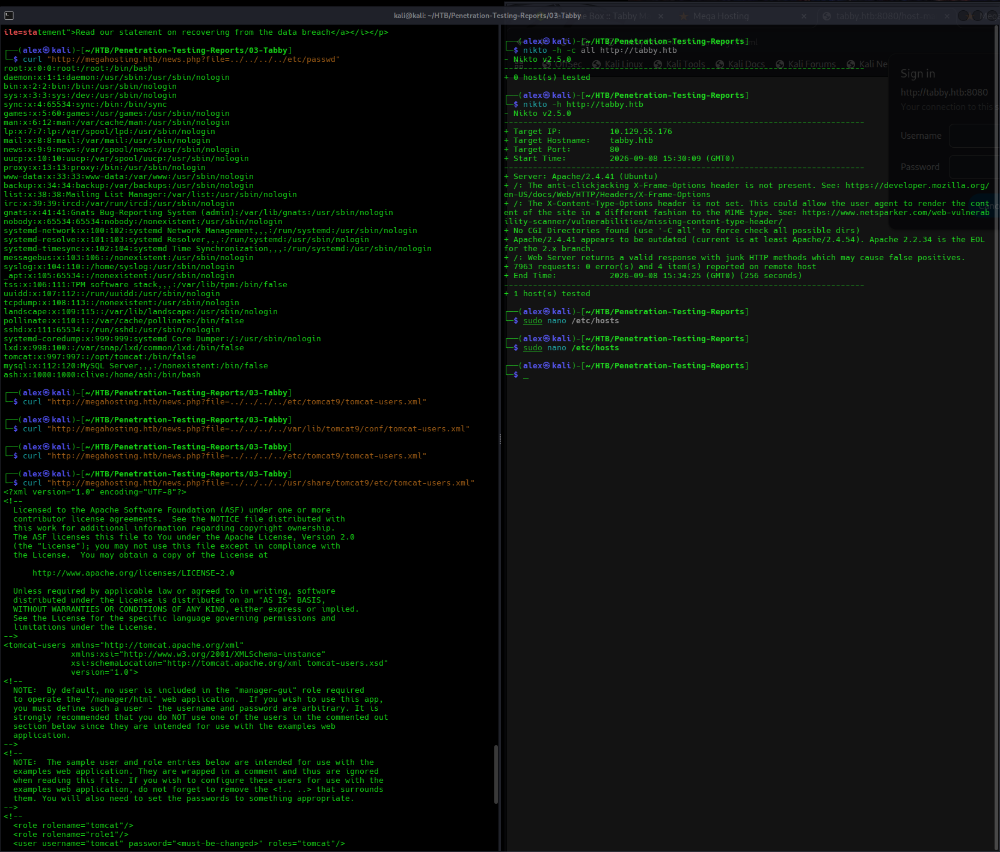

The recovered user configuration and role assignments were further confirmed from the complete XML response.

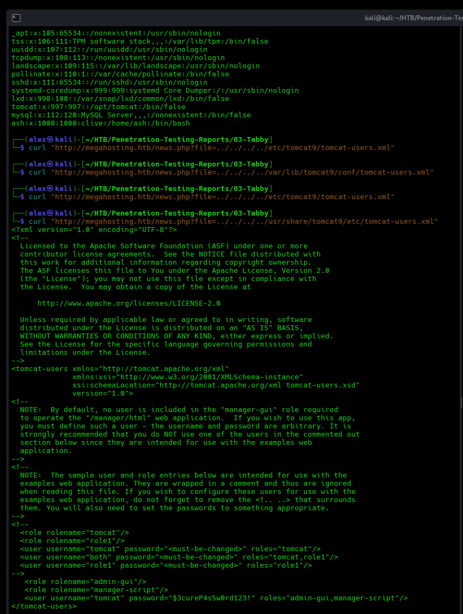

---

### 7. Tomcat Administrative Access

The recovered credentials were used to authenticate against the Tomcat administrative interface.

Successful authentication confirmed that the account was active and possessed management privileges.

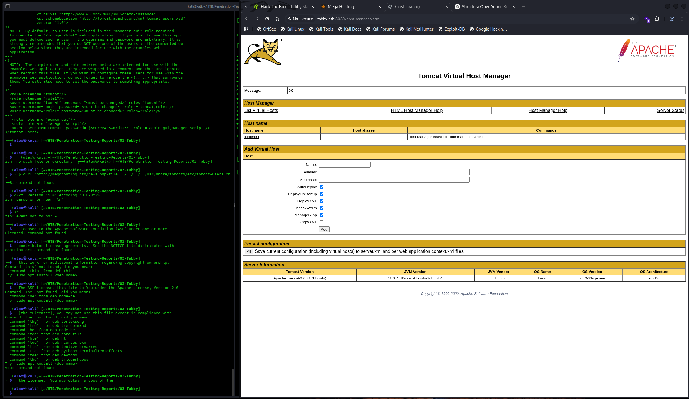

The `manager-script` role was particularly important because it provided access to the Tomcat Manager text interface and application deployment functionality.

---

### 8. WAR Deployment and Initial System Access

Tomcat supports deployment of Java web applications packaged as WAR archives.

A WAR payload was prepared on the assessment system and uploaded through the Tomcat Manager text deployment interface.

Successful deployment was confirmed by the Tomcat Manager response.

The deployed application was then requested over HTTP while a listener was running on the assessment system.

The target initiated a reverse connection to the assessment system.

The resulting shell was running as:

`tomcat`

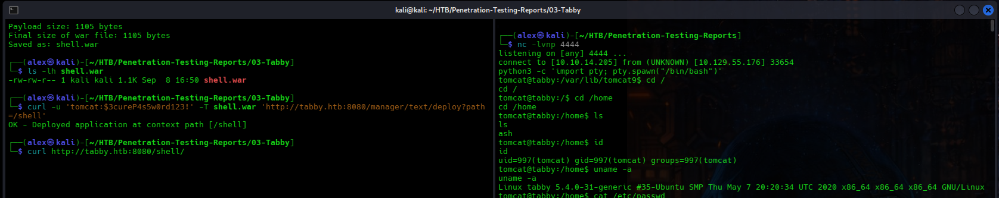

This established an interactive operating system foothold on the target.

---

### 9. Local Privilege-Escalation Enumeration

Post-exploitation enumeration was performed from the `tomcat` account.

A search for SUID executables identified:

`/usr/bin/pkexec`

The executable was owned by root and had the SUID permission enabled.

The installed PolicyKit package was identified as:

`policykit-1 0.105-26ubuntu1`

Package information showed that a newer security-updated version was available.

The installed version and SUID configuration made the host a candidate for CVE-2021-4034, commonly known as PwnKit.

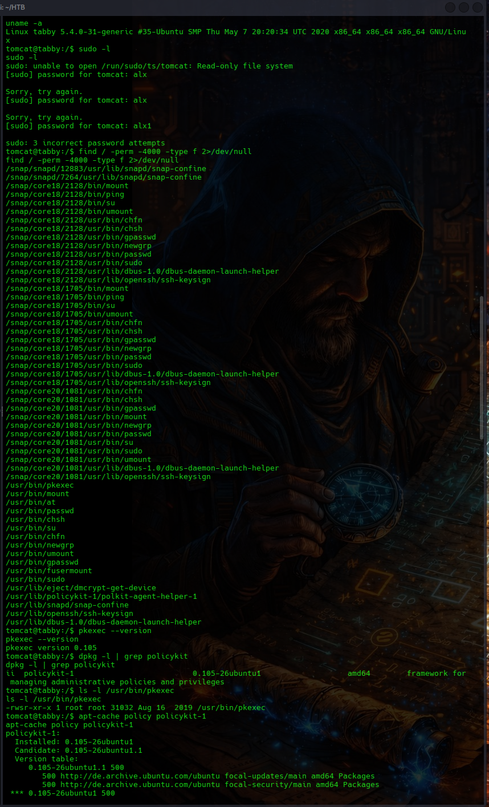

---

### 10. PwnKit Exploit Preparation

A public proof-of-concept for CVE-2021-4034 was reviewed and prepared on the assessment system.

The exploit required several components associated with the `gconv` loading mechanism.

An initial executable compiled on the assessment system failed on the target because it required a newer GLIBC version:

`GLIBC_2.34 not found`

To resolve the compatibility issue, the primary exploit executable was rebuilt as a statically linked x86-64 binary.

The required exploit components were transferred to a writable directory on the target.

---

### 11. Root Privilege Escalation

The statically linked CVE-2021-4034 proof-of-concept was executed from the compromised `tomcat` shell.

Successful exploitation resulted in a privileged shell.

Root-level access was verified using:

`whoami`

Result:

`root`

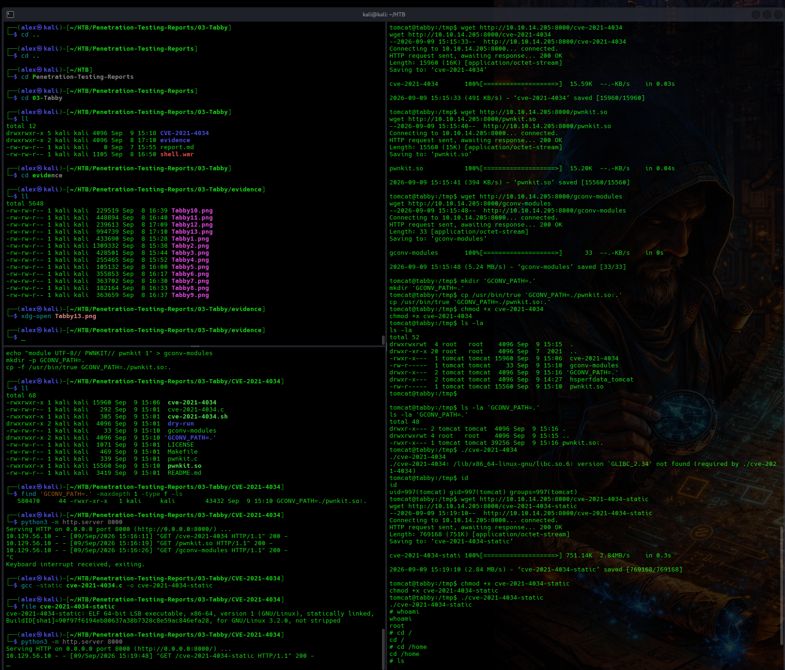

The target was fully compromised.

The user and root proof files were accessible following privilege escalation. Their values have intentionally been excluded from this public report.

### Complete Attack Path

Mega Hosting Web Application  
↓  
news.php?file=  
↓  
Path Traversal / Local File Inclusion  
↓  
Sensitive Local File Read  
↓  
Tomcat User Configuration Disclosure  
↓  
Tomcat Administrative Credentials  
↓  
manager-script Access  
↓  
WAR Application Deployment  
↓  
Remote Code Execution  
↓  
tomcat  
↓  
SUID pkexec / Outdated PolicyKit  
↓  
CVE-2021-4034 (PwnKit)  
↓  
root

---

## Technical Findings

### TB-01 — Path Traversal / Local File Inclusion

**Severity:** High

**Affected Asset:** `megahosting.htb` — `news.php?file=`

#### Description

The Mega Hosting web application used a user-controlled `file` parameter to select server-side content.

The parameter did not adequately restrict filesystem traversal.

By supplying traversal sequences, files outside the intended application directory could be retrieved from the underlying operating system.

The vulnerability was confirmed by retrieving `/etc/passwd`.

#### Evidence

The vulnerable request pattern was identified as:

`news.php?file=statement`

Traversal sequences were then used to request a local system file.

The server returned the contents of:

`/etc/passwd`

Evidence screenshots:

`evidence/06-lfi-discovery-via-file-parameter.png`  
`evidence/07-lfi-confirmation-and-tomcat-credential-disclosure.png`

#### Impact

An unauthenticated attacker with access to the vulnerable endpoint could retrieve sensitive files readable by the web application process.

During the assessment, the vulnerability exposed local account information and the Tomcat authentication configuration.

This directly enabled further compromise of the target.

#### Root Cause

User-controlled input was used to resolve a local filesystem resource without sufficient path validation or restriction.

#### Recommendation

Avoid using untrusted user input directly in filesystem paths.

Where server-side file selection is required:

- Use predefined identifiers mapped to approved files.
- Restrict file access to a fixed application directory.
- Canonicalize requested paths before access.
- Reject traversal sequences and unexpected path separators.
- Apply least-privilege filesystem permissions to the web application service account.

---

### TB-02 — Tomcat Credential Disclosure

**Severity:** High

**Affected Asset:** `/usr/share/tomcat9/etc/tomcat-users.xml`

#### Description

The path traversal / local file inclusion vulnerability allowed the Tomcat user configuration file to be retrieved remotely.

The configuration contained an active Tomcat account with administrative roles including:

`admin-gui`  
`manager-script`

The associated password was stored in cleartext within the XML configuration.

#### Evidence

The following configuration file was retrieved through the vulnerable web application:

`/usr/share/tomcat9/etc/tomcat-users.xml`

The file disclosed an active Tomcat management account and associated roles.

Sensitive credential values have intentionally been excluded from this report.

Evidence screenshots:

`evidence/07-lfi-confirmation-and-tomcat-credential-disclosure.png`  
`evidence/08-tomcat-credentials-confirmed.png`

#### Impact

An attacker able to exploit the file disclosure vulnerability could recover valid administrative credentials.

During the assessment, the disclosed credentials provided authenticated access to Tomcat management functionality.

The `manager-script` role subsequently enabled application deployment and remote code execution.

#### Root Cause

Sensitive authentication material was stored in a plaintext configuration file which became accessible through the vulnerable web application.

#### Recommendation

Prevent arbitrary local file access within the web application.

In addition:

- Rotate all credentials exposed through the vulnerable configuration.
- Restrict access to Tomcat configuration files using appropriate filesystem permissions.
- Use unique credentials dedicated to Tomcat administration.
- Limit administrative roles to the minimum required.
- Restrict Tomcat management interfaces to trusted administrative systems or networks.

---

### TB-03 — Remote Code Execution Through Tomcat Manager WAR Deployment

**Severity:** Critical

**Affected Asset:** Apache Tomcat Manager on TCP 8080

#### Description

The Tomcat credentials recovered through local file disclosure were assigned the `manager-script` role.

This role provided access to the Tomcat Manager text interface, including WAR application deployment functionality.

A malicious WAR application was successfully uploaded and deployed through the management interface.

Requesting the deployed application caused the server to execute attacker-controlled code and establish a reverse shell.

#### Evidence

Valid administrative access was confirmed against the Tomcat management application.

A WAR payload was then deployed through the Manager text interface.

Successful deployment resulted in a reverse connection from the target.

The resulting shell was running as:

`tomcat`

Evidence screenshots:

`evidence/09-tomcat-host-manager-access.png`  
`evidence/10-war-deployment-and-tomcat-reverse-shell.png`

#### Impact

An attacker possessing the exposed management credentials could execute arbitrary server-side code.

Successful exploitation resulted in interactive operating system access as the Tomcat service account.

This converted the original web application file-disclosure weakness into full remote command execution on the host.

#### Root Cause

Administrative Tomcat deployment functionality was accessible using credentials exposed through another application vulnerability.

The management service was reachable from the assessment network and the compromised account possessed deployment privileges.

#### Recommendation

Restrict Tomcat Manager and Host Manager to trusted administrative networks.

Additionally:

- Remove unused Tomcat management applications from production systems.
- Remove unnecessary deployment privileges from service accounts.
- Rotate the compromised management credentials.
- Apply least-privilege role assignments.
- Monitor administrative deployment activity for unauthorized WAR applications.
- Use network-level access controls to limit exposure of administrative interfaces.

---

### TB-04 — PwnKit Local Privilege Escalation (CVE-2021-4034)

**Severity:** Critical

**Affected Asset:** `/usr/bin/pkexec` / PolicyKit

#### Description

The target contained an outdated PolicyKit package and a SUID-enabled `pkexec` executable.

The installed package version was:

`policykit-1 0.105-26ubuntu1`

The vulnerable configuration permitted exploitation of CVE-2021-4034, commonly known as PwnKit.

The vulnerability allows a local unprivileged user to abuse `pkexec` and execute code with root privileges.

A public proof-of-concept was successfully used from the compromised `tomcat` account.

#### Evidence

Local SUID enumeration identified:

`/usr/bin/pkexec`

The installed package was confirmed as:

`policykit-1 0.105-26ubuntu1`

The proof-of-concept required adaptation because the initial binary compiled on the assessment system depended on a newer GLIBC version.

The primary exploit executable was rebuilt as a statically linked binary and successfully executed on the target.

Root privileges were verified using:

`whoami`

Result:

`root`

Evidence screenshots:

`evidence/11-pkexec-pwnkit-enumeration.png`  
`evidence/12-pwnkit-exploitation-and-root-shell.png`

#### Impact

Any attacker who obtains local command execution under a low-privileged account could escalate privileges to root.

During the assessment, compromise of the `tomcat` account was successfully escalated to unrestricted administrative access.

Root access provides complete control over the operating system, including system configuration, credentials, application data and running services.

#### Root Cause

The operating system was running an outdated and vulnerable PolicyKit package containing the `pkexec` privilege-escalation vulnerability.

#### Recommendation

Upgrade PolicyKit to a vendor-supported version containing the security fix for CVE-2021-4034.

Additionally:

- Maintain a regular operating system patching process.
- Monitor installed packages for known vulnerabilities.
- Remove unnecessary SUID permissions where operationally possible.
- Perform regular vulnerability scanning against operating system packages.
- Prioritise security updates affecting local privilege boundaries.

---

## Remediation Summary

The following remediation actions are recommended in order of priority:

1. Fix the path traversal / local file inclusion vulnerability in `news.php`.
2. Upgrade PolicyKit to a version patched against CVE-2021-4034.
3. Rotate all Tomcat credentials exposed through the vulnerable configuration.
4. Restrict Tomcat Manager and Host Manager to trusted administrative networks.
5. Remove unused Tomcat management applications where operationally possible.
6. Remove unnecessary Tomcat administrative and deployment roles.
7. Apply restrictive filesystem permissions to sensitive configuration files.
8. Avoid storing reusable administrative credentials in plaintext where possible.
9. Apply least-privilege principles to application and service accounts.
10. Implement regular operating system and application security patching.
11. Monitor Tomcat deployment activity for unauthorized applications.
12. Regularly review SUID binaries and local privilege-escalation exposure.

---

## Limitations

This assessment was performed against a single designated Hack The Box host in a controlled lab environment.

The engagement was conducted as a black-box assessment, with no credentials or internal system information provided before testing.

Testing focused on identifying a viable attack path from unauthenticated network access to full system compromise.

The assessment did not include:

- Source-code review of the complete Mega Hosting application
- Denial-of-service testing
- Persistence mechanisms
- Destructive testing
- Malware deployment
- Testing against systems outside the designated target
- Exhaustive review of every installed operating system package

The findings therefore represent vulnerabilities and weaknesses identified during the assessment window and should not be interpreted as an exhaustive review of every possible security issue on the host.

---

## Conclusion

The Tabby host was fully compromised through a chain of web application, credential-management and operating system vulnerabilities.

Initial reconnaissance identified an Apache web application and an exposed Apache Tomcat service. Web application analysis revealed a user-controlled `file` parameter in `news.php`.

The parameter was vulnerable to path traversal / local file inclusion, allowing arbitrary local files to be retrieved from the target. This exposed the Tomcat user configuration and valid management credentials.

The recovered account possessed the `manager-script` role, providing access to Tomcat application deployment functionality. A malicious WAR application was deployed through the Manager text interface, resulting in remote command execution and an interactive shell as the `tomcat` service account.

Post-exploitation enumeration identified a SUID-enabled `pkexec` executable and an outdated PolicyKit package. The host was vulnerable to CVE-2021-4034. Successful exploitation of PwnKit elevated the compromised service account to root.

The successful attack chain was:

Path Traversal / LFI  
↓  
Tomcat Configuration Disclosure  
↓  
Administrative Credential Recovery  
↓  
Tomcat Manager Access  
↓  
WAR Deployment  
↓  
Remote Code Execution  
↓  
tomcat  
↓  
PwnKit (CVE-2021-4034)  
↓  
root

The assessment demonstrates how insecure file handling, exposed administrative credentials, excessive management privileges and delayed operating system patching can combine to turn a web application weakness into complete operating system compromise.
