# Admirer Penetration Test Report

## Executive Summary

A penetration test was conducted against the Hack The Box machine Admirer to assess the security of its externally accessible services and identify attack paths that could lead to full system compromise.

The assessment identified multiple weaknesses that could be chained together. Initial web enumeration revealed a sensitive administrative directory through `robots.txt`. Further content discovery exposed credentials that provided access to the FTP service, where a historical backup of the web application was available for download.

Analysis of the backup disclosed internal application files, credentials and references to database administration functionality. This led to the discovery of a live Adminer 4.6.2 installation. The outdated Adminer instance could be abused by connecting it to an attacker-controlled MySQL server, allowing a local file from the web server to be retrieved. Reading the live application configuration exposed valid credentials that were reused for SSH access as the local user `waldo`.

Post-exploitation enumeration showed that `waldo` could execute `/opt/scripts/admin_tasks.sh` through `sudo` while preserving the `PYTHONPATH` environment variable. The privileged script executed a Python backup utility that imported the `shutil` module. By controlling Python's module search path, a malicious `shutil.py` module was loaded with root privileges, resulting in complete compromise of the system.

The successful attack path was:

**Sensitive Web Disclosure → Exposed FTP Credentials → Website Backup Disclosure → Adminer 4.6.2 → Arbitrary File Read → Credential Reuse → SSH Access → Sudo/PYTHONPATH Misconfiguration → Python Module Hijacking → Root**

---

## Assessment Scope

| Item | Details |
|---|---|
| Target | Admirer |
| Platform | Hack The Box |
| Target IP | 10.129.229.101 |
| Hostname | admirer.htb |
| Operating System | Linux / Debian |
| Assessment Type | Black-box penetration test |
| Assessment Date | 11 September 2026 |

The objective of the assessment was to identify vulnerabilities affecting the target, validate their practical impact and determine whether they could be chained to achieve full system compromise.

Testing was restricted to the designated Hack The Box target and supporting attacker infrastructure used during exploitation.

---

## Methodology

The assessment followed a structured penetration testing methodology covering reconnaissance, vulnerability identification, exploitation, post-exploitation enumeration and privilege escalation.

### Reconnaissance

The target was examined to identify exposed services, web content and potentially sensitive resources.

Tools and techniques included:

- Nmap service enumeration
- Manual HTTP inspection
- `robots.txt` analysis
- FFUF content discovery
- FTP enumeration
- Source and backup file analysis
- Application fingerprinting

### Vulnerability Identification

Discovered services and application files were reviewed for:

- Sensitive information disclosure
- Exposed credentials
- Insecure backup storage
- Outdated web applications
- Credential reuse
- Unsafe privileged script execution
- Environment-variable trust issues
- Python module search-path manipulation

### Exploitation

Exploitation involved:

- Using disclosed FTP credentials
- Retrieving the website backup
- Identifying Adminer 4.6.2
- Using an attacker-controlled MySQL server to trigger arbitrary file retrieval
- Extracting credentials from the live web application
- Reusing the recovered credentials for SSH access

### Post-Exploitation Enumeration

After obtaining SSH access as `waldo`, local enumeration focused on:

- User and group membership
- Sudo privileges
- Privileged scripts
- Backup processes
- Python imports
- Environment variables preserved by sudo

### Privilege Escalation

Privilege escalation was achieved by abusing the preserved `PYTHONPATH` environment variable and the Python module import behaviour of a root-executed backup script.

---

## Risk Rating

| Severity | Description |
|---|---|
| Critical | Vulnerability can directly or indirectly result in complete system compromise or root-level access. |
| High | Vulnerability can provide significant unauthorized access, sensitive information disclosure or an important step toward system compromise. |
| Medium | Vulnerability provides useful information or limited access that requires additional weaknesses to achieve significant impact. |
| Low | Vulnerability has limited direct security impact but may assist an attacker during enumeration. |
| Informational | Observation with minimal direct security impact but relevant to the overall security posture. |

---

## Findings Overview

| Finding ID | Finding | Severity |
|---|---|---|
| AD-01 | Sensitive Administrative Directory Disclosure | Medium |
| AD-02 | Exposed Credentials and Sensitive Backup Files | High |
| AD-03 | Adminer 4.6.2 Arbitrary File Read | Critical |
| AD-04 | Credential Reuse Enabling SSH Access | High |
| AD-05 | Sudo PYTHONPATH Misconfiguration and Python Module Hijacking | Critical |

---

## Compromise Walkthrough

### 1. Web Enumeration and Sensitive Directory Discovery

Initial web enumeration identified a `robots.txt` file on the target.

The file contained the following entry:

    Disallow: /admin-dir

A comment explicitly indicated that the directory contained personal contacts and credentials. This disclosed a high-value location that would otherwise not have been immediately visible through normal navigation.

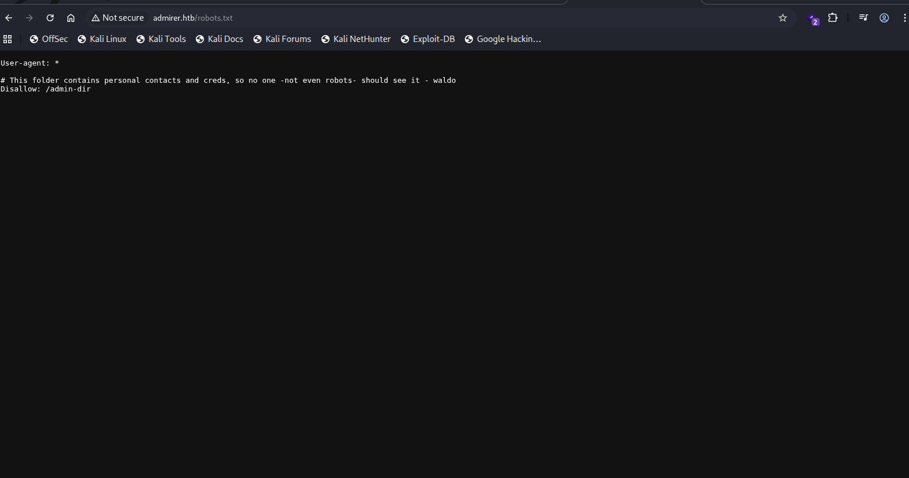

### 2. Administrative Directory Enumeration

The disclosed `/admin-dir` path was enumerated using FFUF.

Content discovery identified `contacts.txt`, which contained usernames and email addresses belonging to several users associated with the target.

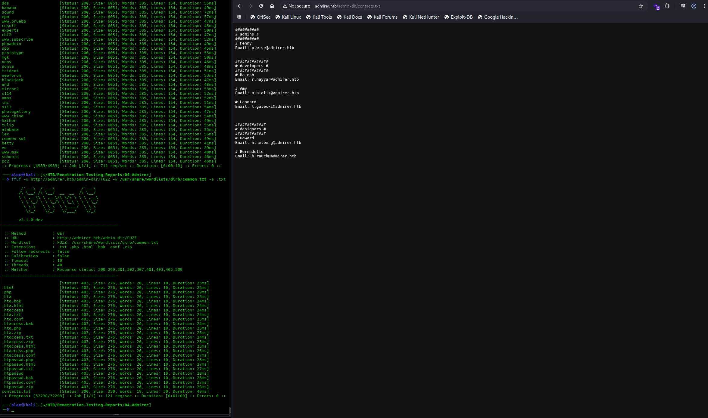

Further enumeration identified `credentials.txt`. The file contained credentials for several services, including an internal mail account, FTP and WordPress.

The disclosed FTP account was successfully used to authenticate to the FTP service.

The FTP server contained two important files:

    dump.sql
    html.tar.gz

Both files were downloaded for offline analysis.

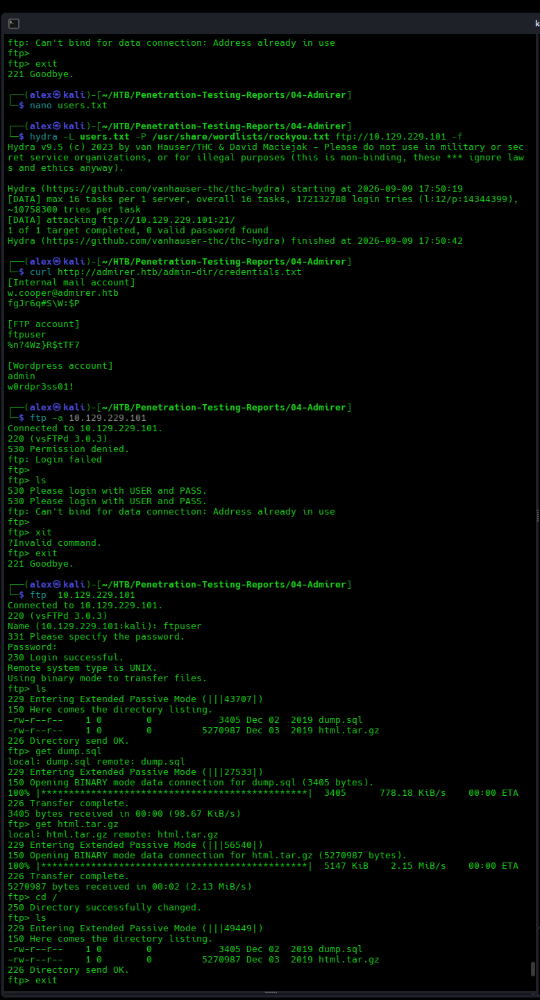

### 3. Database Dump Analysis

The retrieved `dump.sql` file contained a MariaDB database dump for `admirerdb`.

Inspection showed an `items` table containing content used by the website. No immediately useful authentication credentials were identified in the database dump.

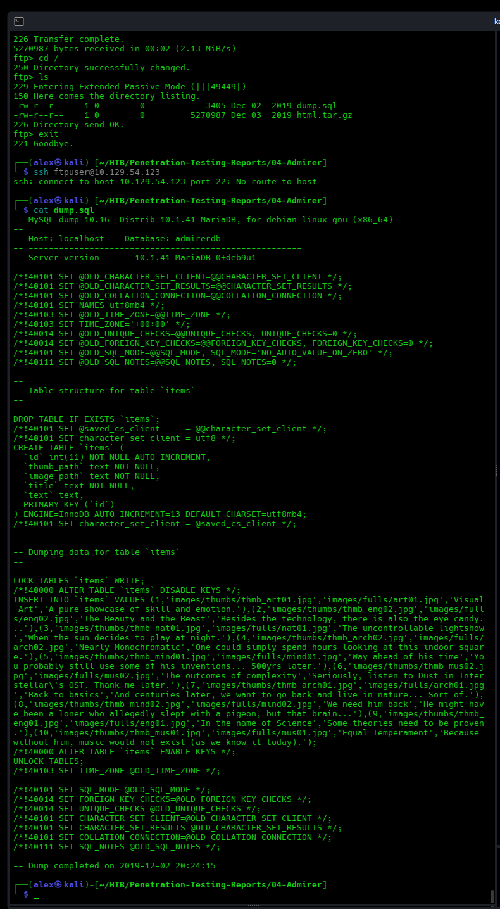

### 4. Website Backup Analysis

The `html.tar.gz` archive was extracted locally.

The archive contained a historical copy of the website, including application assets, images, administrative files and utility scripts.

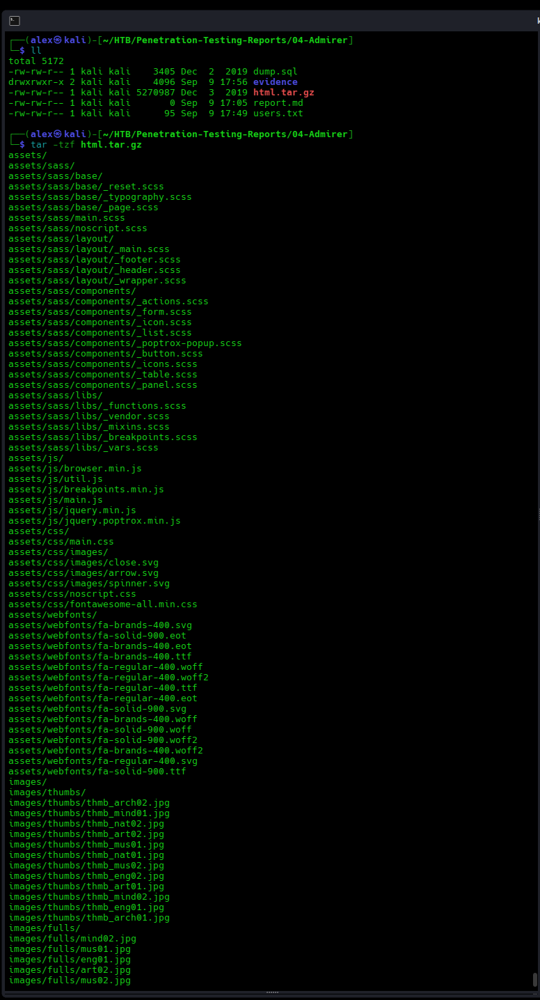

A hidden backup directory contained historical credentials and contact information. These credentials provided additional insight into accounts and services used by the application.

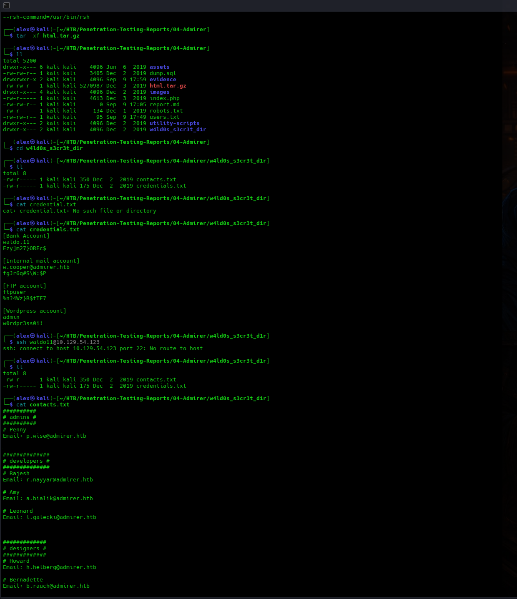

### 5. Utility Script Analysis

The backup contained a `utility-scripts` directory with several PHP files, including:

    admin_tasks.php
    db_admin.php
    info.php
    phptest.php

The `db_admin.php` file contained database connection logic using the account `waldo`.

More importantly, a developer comment stated:

    TODO: Finish implementing this or find a better open source alternative

This suggested that the custom database administration functionality may have been replaced by an open-source database management application.

The `admin_tasks.php` file also revealed references to the system script:

    /opt/scripts/admin_tasks.sh

This information later became relevant during local privilege escalation.

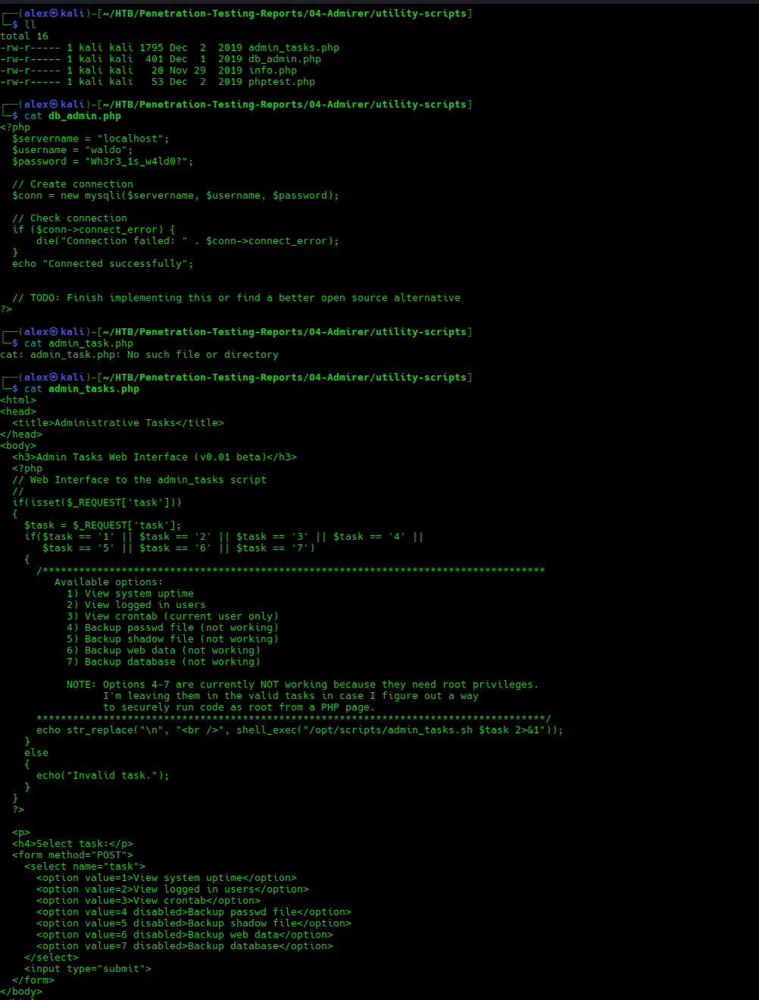

### 6. Adminer Discovery

Further inspection of the live `/utility-scripts/` directory identified:

    /utility-scripts/adminer.php

The application was accessible and identified itself as Adminer version 4.6.2.

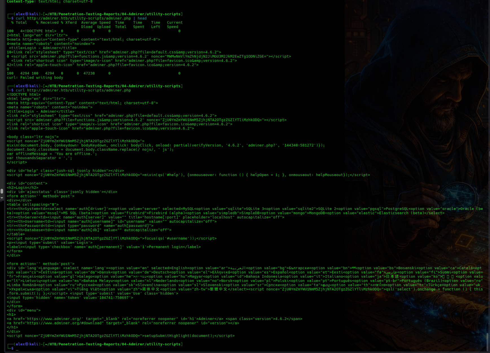

Inspection of the Adminer application and the historical database configuration confirmed that the environment used MySQL-compatible database connectivity.

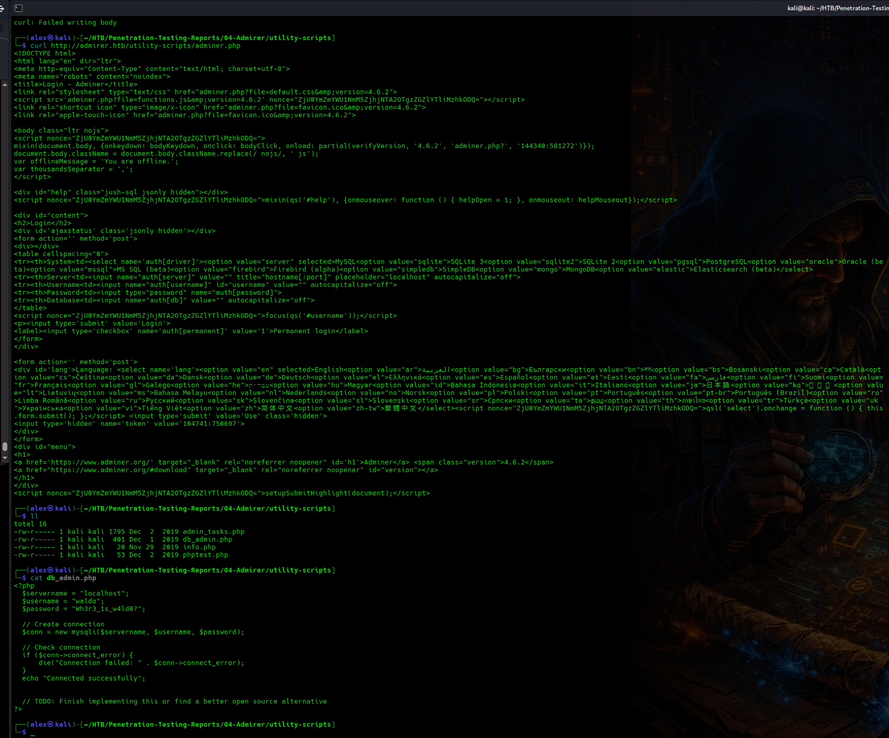

### 7. Adminer Arbitrary File Read Preparation

Adminer 4.6.2 was investigated for known security weaknesses.

A rogue MySQL server technique was selected that causes the Adminer MySQL client to provide the contents of a local file to an attacker-controlled server.

The requested file was configured as:

    /var/www/html/index.php

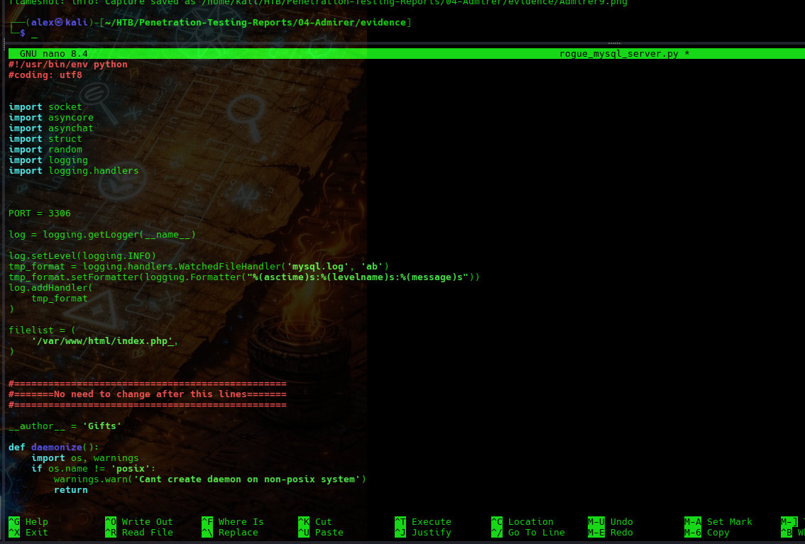

The rogue MySQL server tooling was then prepared on the attacker system.

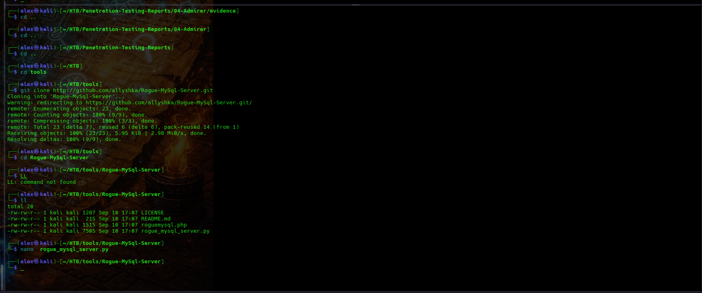

### 8. Rogue MySQL Connection Through Adminer

Adminer was configured to connect to the attacker-controlled MySQL service using the attacker VPN address.

The purpose of the connection was not to authenticate to a legitimate database. Instead, the malicious MySQL server controlled the protocol interaction with Adminer.

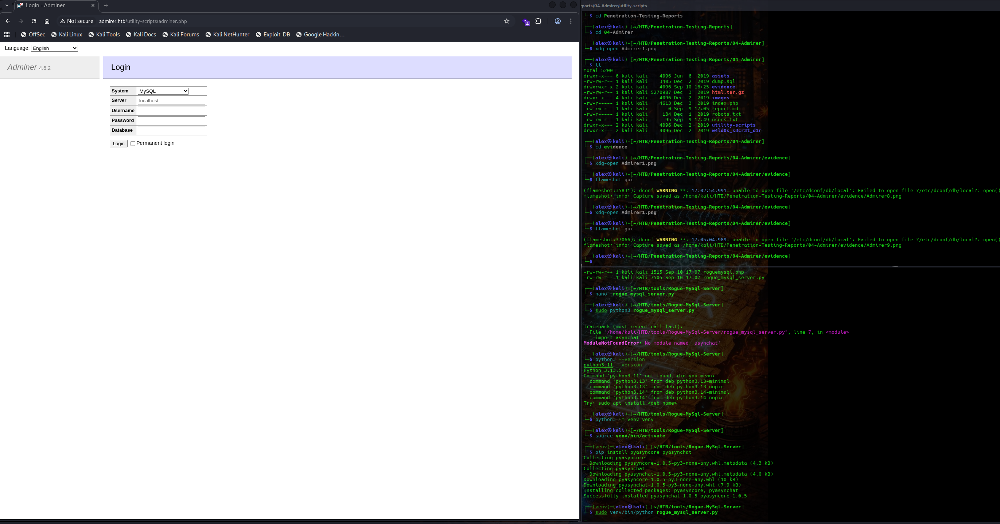

Initial interaction with the rogue server confirmed that the target could establish an outbound connection to the attacker-controlled MySQL service.

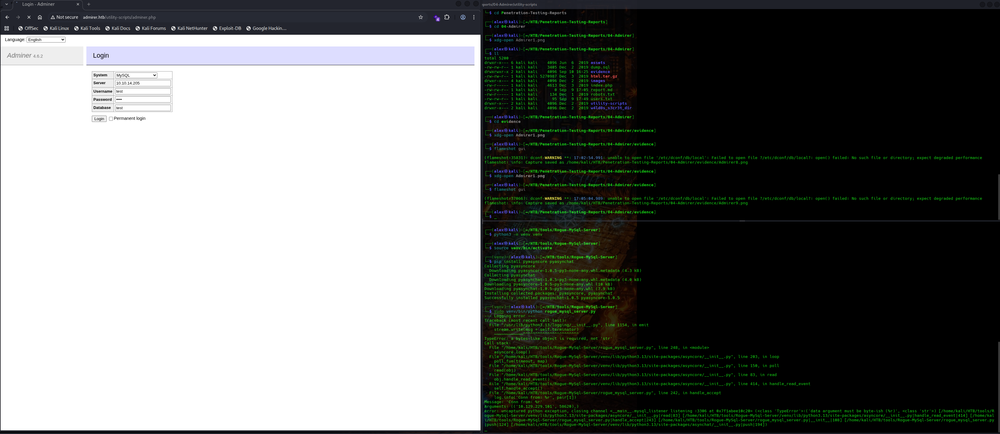

### 9. Arbitrary File Read

After establishing the malicious MySQL interaction, Adminer supplied the requested local file:

    /var/www/html/index.php

The live application source contained database connection credentials that differed from those found in the historical backup.

This demonstrated that the vulnerable Adminer installation could be used to retrieve sensitive files accessible to the web application.

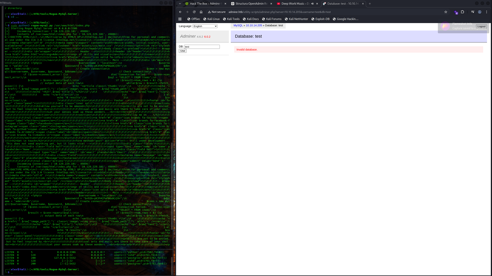

### 10. SSH Access as Waldo

The credentials recovered from the live application were tested against SSH.

Authentication succeeded as:

    waldo@admirer

This provided an interactive shell on the target.

Local enumeration confirmed that `waldo` belonged to the `admins` group.

Running:

    sudo -l

revealed that the user could execute:

    /opt/scripts/admin_tasks.sh

through sudo.

The sudo configuration also preserved the `PYTHONPATH` environment variable.

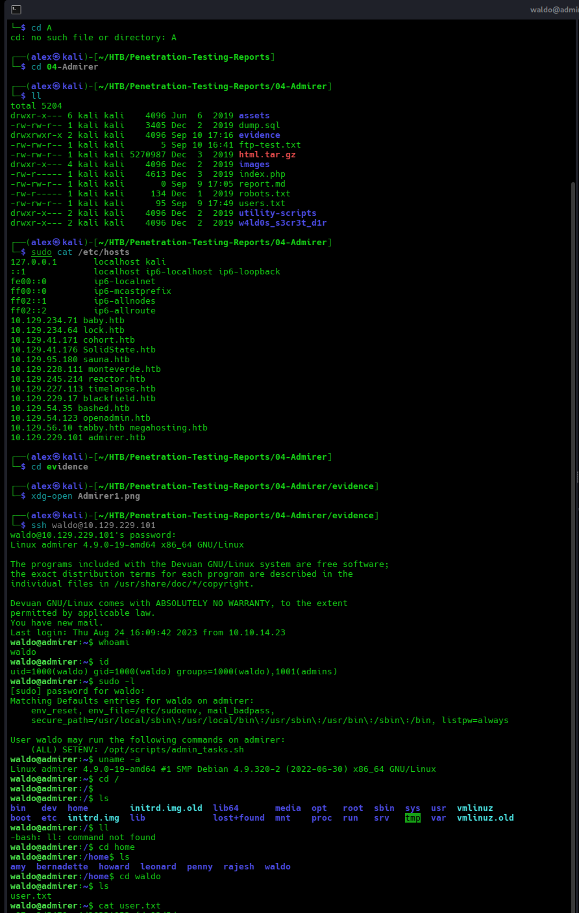

### 11. Privileged Administrative Script Analysis

The privileged script was inspected:

    cat /opt/scripts/admin_tasks.sh

The script contained several administrative and backup functions.

The web-backup function executed:

    /opt/scripts/backup.py

Because `admin_tasks.sh` could be executed with sudo, the backup process could ultimately execute Python code with root privileges.

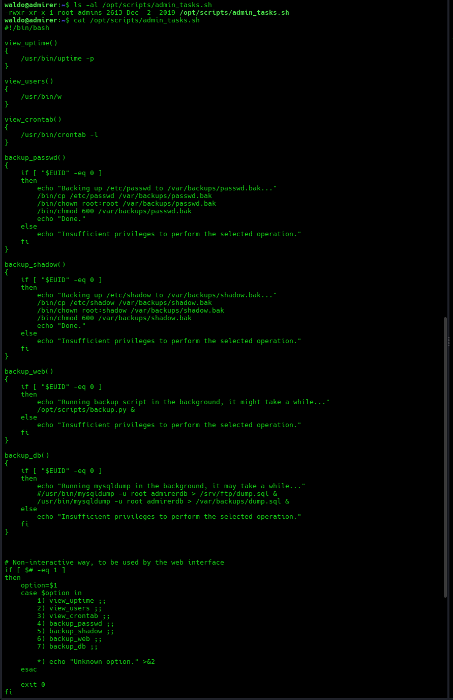

### 12. Python Backup Script Analysis

The backup script contained:

    from shutil import make_archive

It then used `make_archive()` to create a backup of the web directory.

Because Python resolves imported modules using its module search path, control over `PYTHONPATH` could influence which `shutil` module was loaded.

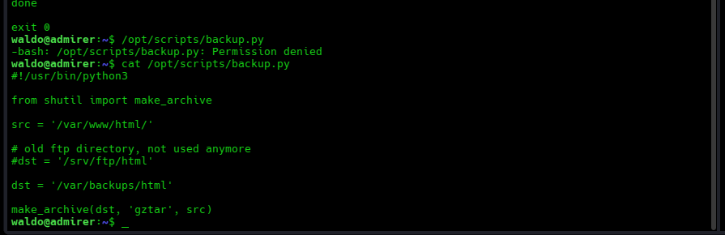

### 13. PYTHONPATH Module Hijacking

A malicious `shutil.py` module was created in a writable directory.

The module implemented the expected `make_archive()` function while executing commands that created a SUID copy of Bash:

    import os

    def make_archive(*args, **kwargs):
        os.system("cp /bin/bash /tmp/rootbash")
        os.system("chmod u+s /tmp/rootbash")

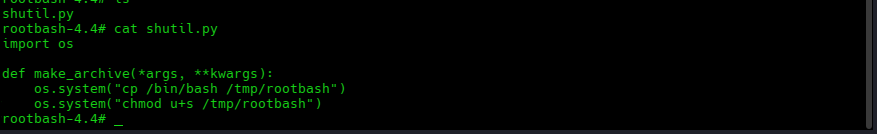

The privileged administrative script was then executed while setting `PYTHONPATH` to the attacker-controlled directory:

    sudo PYTHONPATH=/tmp/privesc /opt/scripts/admin_tasks.sh

The web-backup option caused `/opt/scripts/backup.py` to execute as root.

Instead of importing the legitimate Python `shutil` library, Python imported the attacker-controlled module.

The resulting `/tmp/rootbash` binary was owned by root and had the SUID permission set.

It was executed with:

    /tmp/rootbash -p

Verification with `whoami` returned:

    root

This confirmed complete system compromise.

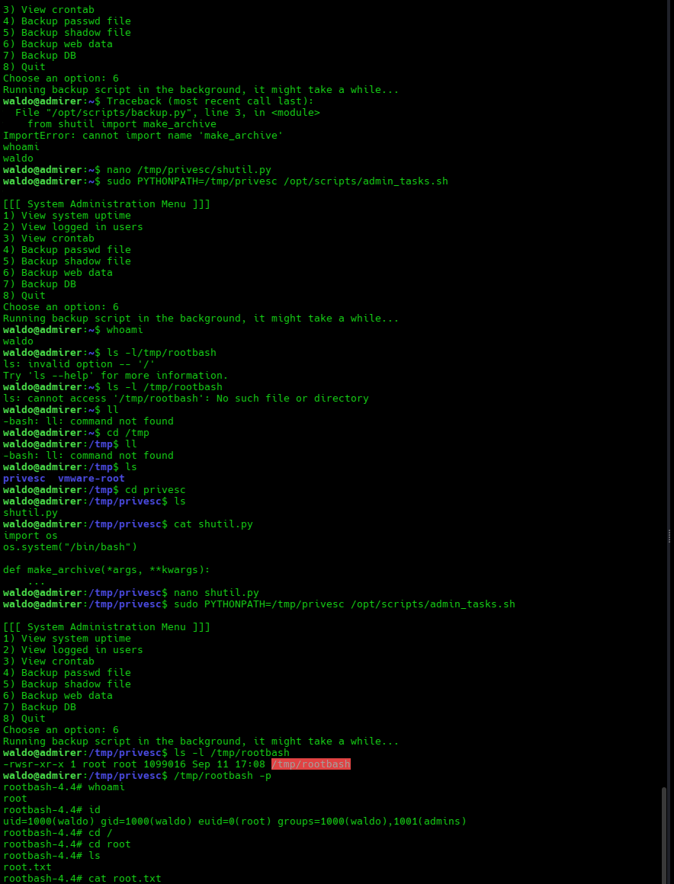

### Complete Attack Path

    robots.txt
        ↓
    /admin-dir disclosure
        ↓
    credentials.txt
        ↓
    FTP credentials
        ↓
    FTP authentication
        ↓
    dump.sql + html.tar.gz
        ↓
    Historical website backup
        ↓
    db_admin.php / utility script analysis
        ↓
    Open-source database administration clue
        ↓
    Adminer 4.6.2
        ↓
    Rogue MySQL server
        ↓
    Arbitrary file read
        ↓
    /var/www/html/index.php
        ↓
    Live credentials
        ↓
    SSH access as waldo
        ↓
    sudo /opt/scripts/admin_tasks.sh
        ↓
    /opt/scripts/backup.py
        ↓
    from shutil import make_archive
        ↓
    Preserved PYTHONPATH
        ↓
    Python module hijacking
        ↓
    SUID Bash
        ↓
    ROOT

---

## Technical Findings

### AD-01 — Sensitive Administrative Directory Disclosure

**Severity:** Medium

**Affected Asset:** `http://admirer.htb/robots.txt` and `/admin-dir`

#### Description

The publicly accessible `robots.txt` file disclosed the existence of `/admin-dir`. The associated comment explicitly indicated that the directory contained personal contacts and credentials.

Although `robots.txt` is intended to provide instructions to web crawlers, it is publicly accessible and must not be used as an access-control mechanism.

#### Evidence

- `evidence/01-robots-txt-admin-dir-disclosure.png`
- `evidence/02-admin-dir-ffuf-and-contacts-discovery.png`

#### Impact

An unauthenticated attacker can identify a sensitive administrative location and use it to accelerate content discovery. In this assessment, the disclosed directory directly led to exposed credentials and subsequent access to the FTP service.

#### Root Cause

Sensitive application paths were disclosed through a publicly accessible crawler configuration file, while the underlying directory remained accessible without authentication.

#### Recommendation

Remove sensitive path references from `robots.txt` and enforce proper server-side authorization on administrative and sensitive resources. Files containing credentials should never be stored within publicly accessible web directories.

---

### AD-02 — Exposed Credentials and Sensitive Backup Files

**Severity:** High

**Affected Asset:** `/admin-dir/credentials.txt` and FTP service

#### Description

A plaintext credentials file was accessible through the web application and exposed credentials for multiple services.

The FTP credentials were valid and provided access to a historical website archive and database dump.

The website archive contained additional internal application files, historical credentials and administrative scripts.

#### Evidence

- `evidence/03-credential-disclosure-and-ftp-backup-download.png`
- `evidence/04-database-dump-enumeration.png`
- `evidence/05-web-backup-archive-enumeration.png`
- `evidence/06-backup-credentials-and-contacts-disclosure.png`
- `evidence/07-utility-scripts-db-admin-and-admin-tasks-analysis.png`

#### Impact

An unauthenticated attacker could obtain service credentials and use them to access internal backup data. The backup significantly expanded the available attack surface by exposing application source code, historical configuration and administrative functionality.

#### Root Cause

Sensitive credentials were stored in plaintext within web-accessible content, while historical application backups were exposed through an externally accessible FTP service.

#### Recommendation

Remove credentials from web-accessible files and rotate all exposed passwords. Store secrets using an appropriate secrets-management mechanism or protected configuration storage.

Restrict backup repositories to authorized administrators and prevent externally accessible services from exposing historical application source code or configuration files.

---

### AD-03 — Adminer 4.6.2 Arbitrary File Read

**Severity:** Critical

**Affected Asset:** `/utility-scripts/adminer.php`

#### Description

The target exposed Adminer version 4.6.2.

The application could be instructed to connect to an attacker-controlled MySQL server. By manipulating the MySQL client/server interaction, the rogue server was able to request a local file from the Adminer client.

The attack successfully retrieved:

    /var/www/html/index.php

The retrieved application source contained current database credentials.

#### Evidence

- `evidence/08-adminer-4.6.2-discovery.png`
- `evidence/09-adminer-version-and-backup-db-credentials.png`
- `evidence/10-rogue-mysql-file-read-configuration.png`
- `evidence/11-rogue-mysql-server-setup.png`
- `evidence/12-adminer-login-and-rogue-mysql-setup.png`
- `evidence/13-adminer-rogue-mysql-connection-attempt.png`
- `evidence/14-adminer-arbitrary-file-read-index-php.png`

#### Impact

An attacker able to access the Adminer interface could retrieve sensitive local files readable by the web application. In this assessment, the vulnerability disclosed current application credentials and enabled progression from web access to operating-system access.

#### Root Cause

An outdated Adminer installation was exposed through the web application and was permitted to establish connections to attacker-controlled database servers.

#### Recommendation

Upgrade Adminer to a supported and fully patched release or remove it if it is not required.

Restrict database administration interfaces to trusted administrative networks and authenticated users. Outbound network connectivity from web applications should also be limited to explicitly required destinations.

---

### AD-04 — Credential Reuse Enabling SSH Access

**Severity:** High

**Affected Asset:** SSH service / `waldo` account

#### Description

Credentials recovered from the live web application were valid for the local `waldo` account over SSH.

This demonstrated password reuse between application/database credentials and an operating-system account.

#### Evidence

- `evidence/14-adminer-arbitrary-file-read-index-php.png`
- `evidence/15-ssh-access-waldo-and-sudo-enumeration.png`

#### Impact

Compromise of application credentials directly resulted in interactive operating-system access. This significantly increased the impact of the preceding arbitrary file-read vulnerability and provided the foothold required for local privilege escalation.

#### Root Cause

The same or equivalent authentication secret was reused across separate security boundaries.

#### Recommendation

Enforce unique credentials for database, application and operating-system accounts. Rotate the exposed credentials and consider disabling SSH password authentication in favour of properly managed public-key authentication where appropriate.

---

### AD-05 — Sudo PYTHONPATH Misconfiguration and Python Module Hijacking

**Severity:** Critical

**Affected Asset:** `/opt/scripts/admin_tasks.sh` and `/opt/scripts/backup.py`

#### Description

The `waldo` account was permitted to execute `/opt/scripts/admin_tasks.sh` through sudo while controlling the `PYTHONPATH` environment variable.

The administrative script executed `/opt/scripts/backup.py`, which imported:

    from shutil import make_archive

Because the Python module search path could be influenced through `PYTHONPATH`, an attacker-controlled `shutil.py` could be loaded instead of the legitimate standard-library module.

A malicious module was created that generated a root-owned SUID copy of Bash.

Executing the privileged backup process with the attacker-controlled `PYTHONPATH` resulted in the malicious module executing with root privileges.

#### Evidence

- `evidence/15-ssh-access-waldo-and-sudo-enumeration.png`
- `evidence/16-sudo-admin-tasks-script-enumeration.png`
- `evidence/17-backup-script-shutil-import.png`
- `evidence/18-pythonpath-shutil-hijack-payload.png`
- `evidence/19-pythonpath-privilege-escalation-root.png`

#### Impact

Any user with the identified sudo permission could execute arbitrary Python code as root, resulting in immediate and complete compromise of the operating system.

#### Root Cause

A privileged sudo configuration preserved an attacker-controlled Python environment variable while executing a root-level script that relied on normal Python module resolution.

#### Recommendation

Remove `PYTHONPATH` and other interpreter-related variables from the sudo environment for privileged commands.

Avoid allowing users to influence the runtime environment of privileged scripts. Where Python must be executed with elevated privileges, use a controlled environment and ensure that imported modules resolve only from trusted, root-controlled locations.

Review the sudo policy and grant only the minimum commands and environment permissions required.

---

## Remediation Summary

1. **Remove or upgrade the outdated Adminer installation immediately.** Restrict database administration interfaces to trusted administrative networks.

2. **Remove all plaintext credentials from web-accessible locations** and rotate every credential exposed through the application or historical backup.

3. **Restrict FTP and backup access.** Historical source code, database dumps and configuration files should not be exposed through externally accessible services.

4. **Eliminate credential reuse** between database, application and operating-system accounts.

5. **Correct the sudo configuration** so that users cannot preserve or define `PYTHONPATH` when executing privileged scripts.

6. **Harden privileged Python execution** by using trusted module paths and root-controlled execution environments.

7. **Review outbound network access from the web server** and restrict connections to explicitly required destinations.

8. **Review sensitive information exposure** through `robots.txt`, backup directories and administrative utility paths.

---

## Limitations

The assessment was conducted against a single designated Hack The Box target within an authorized lab environment.

Testing focused on identifying and validating a practical attack path from unauthenticated external access to full system compromise.

The assessment did not include:

- Denial-of-service testing
- Persistence mechanisms
- Destructive actions
- Testing of systems outside the designated target
- Long-term monitoring
- Social engineering

Sensitive flag values obtained during the assessment have intentionally been excluded from this public report.

Credentials are discussed only where necessary to explain the attack chain and should be redacted from any public-facing evidence where appropriate.

---

## Conclusion

The Admirer host was fully compromised through a chain of weaknesses spanning web configuration, credential management, outdated software and privileged script execution.

Initial enumeration exposed `/admin-dir` through `robots.txt`, leading to plaintext FTP credentials. FTP access provided a historical website backup containing internal application files and clues to database administration functionality.

A live Adminer 4.6.2 installation was subsequently identified and abused through an attacker-controlled MySQL server to retrieve the live `index.php` file. Credentials recovered from the application were reused for SSH access as `waldo`.

Local enumeration then revealed that `waldo` could execute an administrative script through sudo while controlling `PYTHONPATH`. Because the privileged backup process imported Python's `shutil` module, the module search path could be hijacked. A malicious replacement module executed as root and produced a privileged shell, resulting in complete compromise.

The successful attack chain was:

    Sensitive directory disclosure
        ↓
    Plaintext credential exposure
        ↓
    FTP access
        ↓
    Historical website backup
        ↓
    Adminer 4.6.2 discovery
        ↓
    Arbitrary local file read
        ↓
    Live credential disclosure
        ↓
    SSH access as waldo
        ↓
    Sudo environment misconfiguration
        ↓
    PYTHONPATH module hijacking
        ↓
    Root-level code execution
        ↓
    Complete system compromise
