# Bastion Penetration Test Report

## Executive Summary

A penetration test was conducted against the Hack The Box machine Bastion to assess the security of its externally accessible services and identify attack paths that could lead to full system compromise.

The assessment identified multiple weaknesses that could be chained together. Initial network enumeration revealed an SMB service that permitted guest access to a share named `Backups`. The share contained a Windows system image backup, including Virtual Hard Disk files representing the target's historical filesystem.

The exposed backup was mounted from the attacker system and inspected without downloading the entire image. Sensitive Windows Registry hives were extracted from the VHD and analysed offline using Impacket. This disclosed authentication material for the local `L4mpje` account, including a valid password that provided SSH access to the target.

Post-exploitation enumeration identified the mRemoteNG remote connection manager. Its user configuration contained a saved connection using the local `Administrator` account and an encrypted password. The configuration was transferred to the attacker system and processed using an mRemoteNG credential decryption utility. The recovered Administrator credential was then successfully used for SSH authentication, resulting in complete administrative compromise of the system.

The successful attack path was:

**Guest SMB Access → Exposed Windows Backup → VHD Inspection → Registry Hive Extraction → Credential Recovery → SSH Access as L4mpje → Local Enumeration → mRemoteNG Configuration Disclosure → Administrator Credential Decryption → Administrator Access**

---

## Assessment Scope

| Item | Details |
|---|---|
| Target | Bastion |
| Platform | Hack The Box |
| Target IP | 10.129.136.29 |
| Hostname | BASTION |
| Operating System | Windows Server 2016 Standard |
| Assessment Type | Black-box penetration test |
| Assessment Date | 15 September 2026 |

The objective of the assessment was to identify vulnerabilities affecting the target, validate their practical impact and determine whether they could be chained to achieve full system compromise.

Testing was restricted to the designated Hack The Box target and supporting attacker infrastructure used during exploitation.

---

## Methodology

The assessment followed a structured penetration testing methodology covering reconnaissance, service enumeration, vulnerability identification, exploitation, post-exploitation enumeration and privilege escalation.

### Reconnaissance

The target was examined to identify exposed services and remotely accessible resources.

Tools and techniques included:

- Nmap service enumeration
- SMB share enumeration
- Guest authentication testing
- Windows backup analysis
- Virtual Hard Disk inspection
- Windows Registry hive extraction
- Offline credential analysis
- SSH authentication testing
- Local Windows enumeration
- Installed application inspection
- DPAPI credential investigation
- mRemoteNG configuration analysis

### Vulnerability Identification

Discovered services, backup data and local application files were reviewed for:

- Anonymous or guest-accessible network shares
- Sensitive backup exposure
- Windows Registry credential material
- Password disclosure
- Credential reuse
- Locally stored encrypted credentials
- Weak protection of administrative credentials
- Sensitive application configuration files

### Exploitation

Exploitation involved:

- Accessing the SMB `Backups` share as a guest user
- Mounting the remote SMB share locally
- Inspecting the Windows VHD backup
- Extracting the `SAM`, `SYSTEM` and `SECURITY` Registry hives
- Recovering local account authentication material
- Using the recovered `L4mpje` password for SSH authentication
- Inspecting mRemoteNG configuration data
- Decrypting the stored Administrator credential
- Reusing the recovered Administrator password for SSH access

### Post-Exploitation Enumeration

After obtaining SSH access as `L4mpje`, local enumeration focused on:

- Current user privileges
- Local group membership
- Installed software
- Windows credential storage
- DPAPI material
- User application configuration files
- Remote management software
- Stored administrative credentials

### Privilege Escalation

Privilege escalation was achieved by recovering the local Administrator password from the mRemoteNG configuration belonging to the compromised `L4mpje` user.

---

## Risk Rating

| Severity | Description |
|---|---|
| Critical | Vulnerability can directly or indirectly result in complete system compromise or Administrator-level access. |
| High | Vulnerability can provide significant unauthorized access, sensitive information disclosure or an important step toward system compromise. |
| Medium | Vulnerability provides useful information or limited access that requires additional weaknesses to achieve significant impact. |
| Low | Vulnerability has limited direct security impact but may assist an attacker during enumeration. |
| Informational | Observation with minimal direct security impact but relevant to the overall security posture. |

---

## Findings Overview

| Finding ID | Finding | Severity |
|---|---|---|
| BA-01 | Guest Access to Sensitive SMB Backup Share | High |
| BA-02 | Windows System Backup Exposure | Critical |
| BA-03 | Recoverable Credentials Within Historical Backup | Critical |
| BA-04 | Stored Administrator Credential in mRemoteNG | Critical |

---

## Compromise Walkthrough

### 1. Network Enumeration

Initial network enumeration was performed using Nmap.

    nmap -sC -sV 10.129.136.29

The scan identified several exposed Windows services, including:

    22/tcp    SSH
    135/tcp   MSRPC
    139/tcp   NetBIOS
    445/tcp   SMB
    5985/tcp  WinRM
    47001/tcp HTTPAPI

Service fingerprinting identified the target as a Windows Server 2016 system.

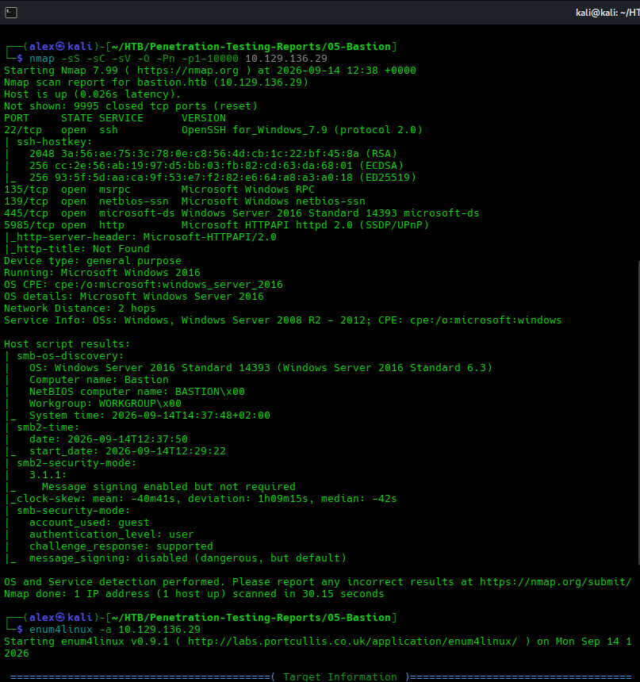

The presence of SMB on TCP port 445 made share enumeration a high-priority next step.

---

### 2. SMB Share Enumeration

SMB was tested for guest or unauthenticated access.

    smbclient -L //10.129.136.29 -N

The target exposed a share named:

    Backups

The share could be accessed without supplying valid user credentials:

    smbclient //10.129.136.29/Backups -N

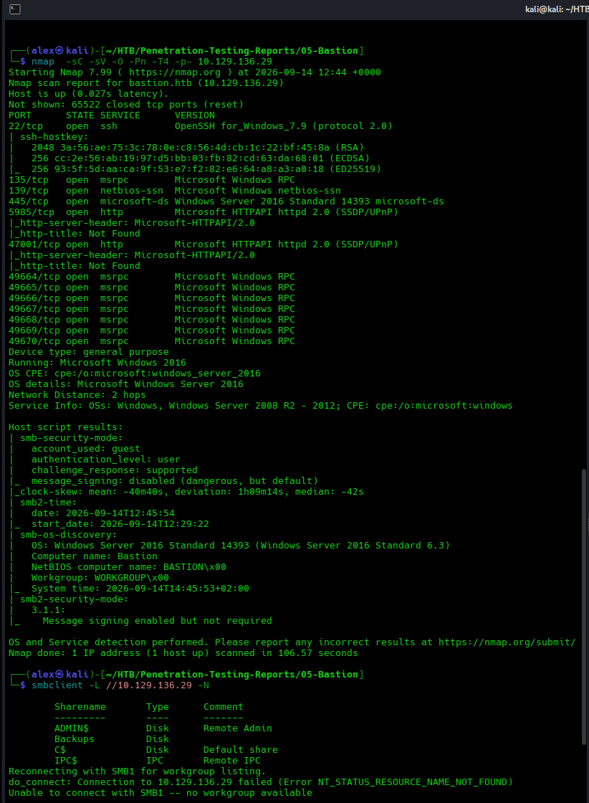

This demonstrated that potentially sensitive backup data was exposed to an unauthenticated or guest network user.

---

### 3. Windows Backup Discovery

Enumeration of the `Backups` share identified:

    WindowsImageBackup

The directory contained a backup belonging to:

    L4mpje-PC

Further navigation revealed a Windows backup created on 22 February 2019.

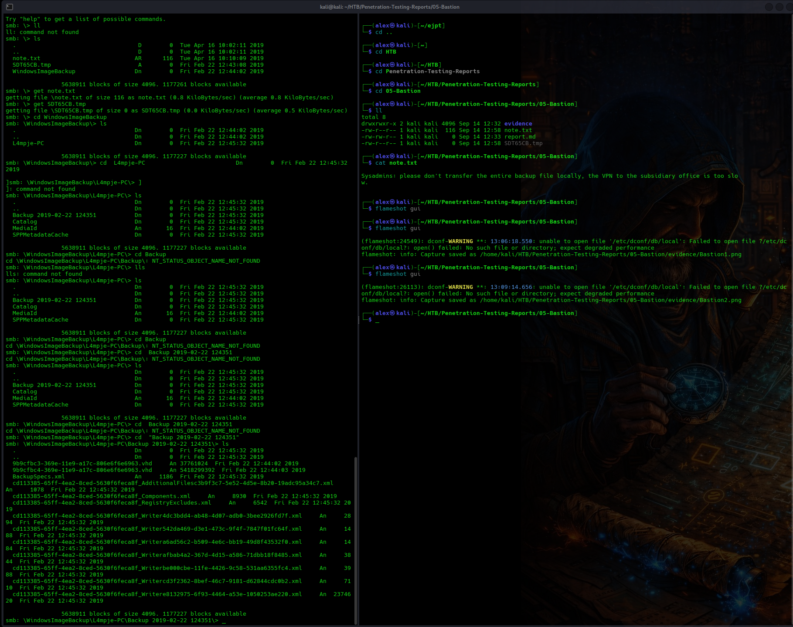

The backup contained two Virtual Hard Disk files and supporting metadata.

One VHD was significantly larger than the other and represented the primary Windows filesystem.

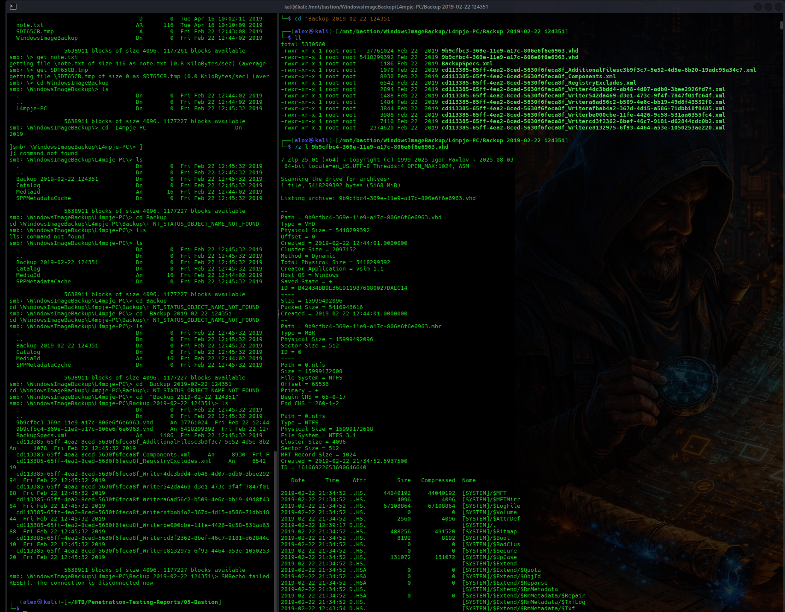

A note stored within the share also warned administrators not to transfer the complete backup over the network, confirming that the backup was intentionally stored on the share.

---

### 4. SMB Share Mounting and VHD Inspection

Rather than downloading the complete multi-gigabyte Windows backup, the SMB share was mounted locally on the attacker system.

A local mount point was created:

    sudo mkdir -p /mnt/bastion

The SMB share was mounted read-only:

    sudo mount -t cifs //10.129.136.29/Backups /mnt/bastion \
    -o username=guest,password=,ro,vers=3.0

The remote backup was then available through:

    /mnt/bastion

This allowed the VHD to be inspected through the local Linux filesystem while the underlying data remained on the remote SMB share.

The larger VHD was enumerated using 7-Zip:

    7z l "/mnt/bastion/WindowsImageBackup/L4mpje-PC/Backup 2019-02-22 124351/9b9cfbc4-369e-11e9-a17c-806e6f6e6963.vhd"

The image contained a complete Windows filesystem, including:

    Windows/System32/config/
    Users/L4mpje/

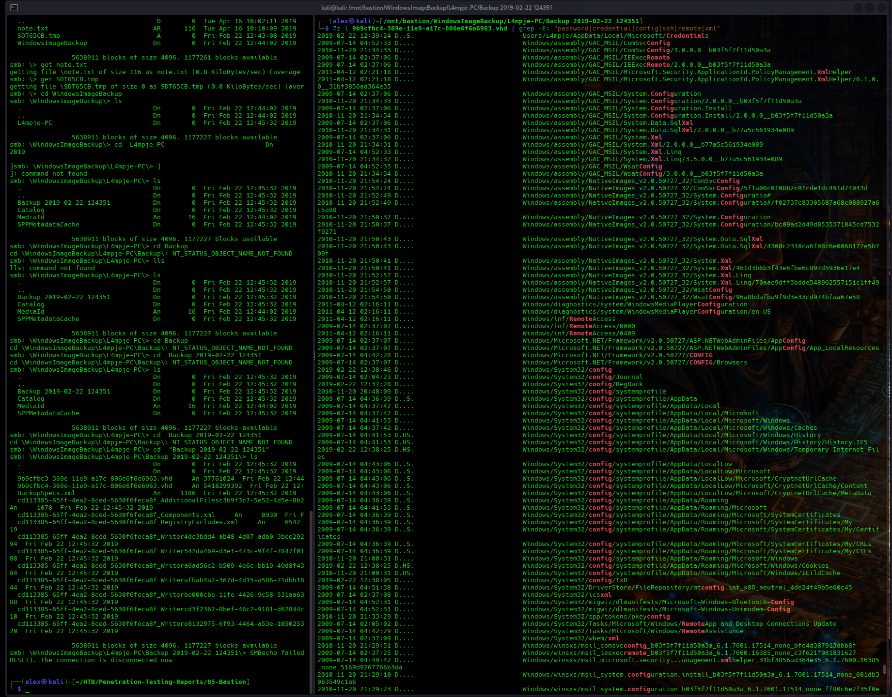

The Registry hive directory was particularly sensitive because it contained files used by Windows to store local account and system security information.

---

### 5. Windows Registry Hive Extraction

The following Registry hives were identified inside the VHD:

    SAM
    SYSTEM
    SECURITY

The files were extracted directly from the backup using 7-Zip.

    7z e "/mnt/bastion/WindowsImageBackup/L4mpje-PC/Backup 2019-02-22 124351/9b9cfbc4-369e-11e9-a17c-806e6f6e6963.vhd" \
    "Windows/System32/config/SAM" \
    "Windows/System32/config/SYSTEM" \
    "Windows/System32/config/SECURITY" \
    -o~/HTB/loot

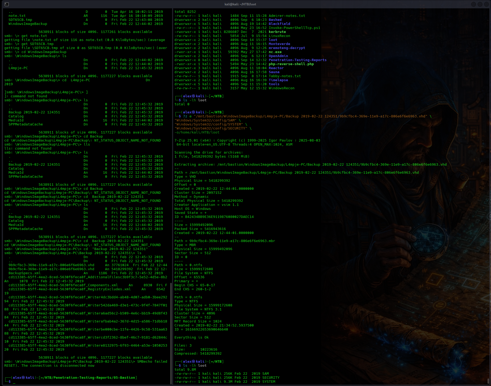

Only the required Registry files were extracted rather than copying the complete Windows backup.

---

### 6. Offline Credential Recovery

The extracted Registry hives were analysed using Impacket `secretsdump`.

    impacket-secretsdump \
    -sam SAM \
    -system SYSTEM \
    -security SECURITY \
    LOCAL

The tool recovered local account password hashes, including the account:

    L4mpje

The `SECURITY` hive also contained an LSA secret named:

    DefaultPassword

The recovered value disclosed a plaintext password associated with the system.

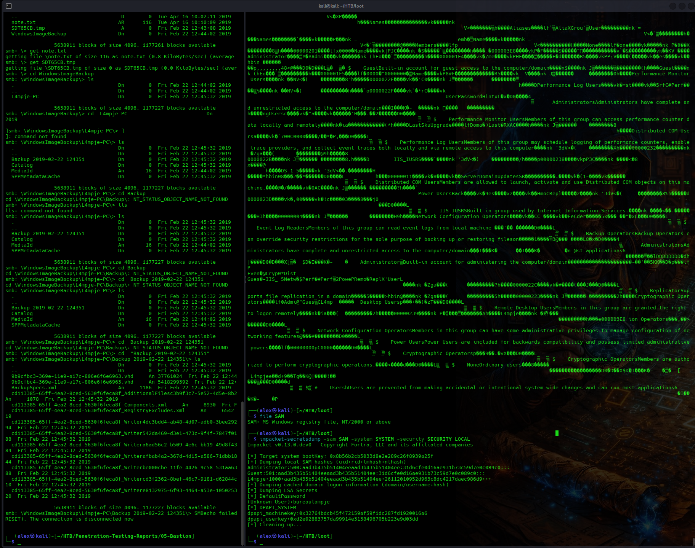

The recovered credential was tested against the exposed SSH service.

---

### 7. SSH Access as L4mpje

The credential recovered from the historical Windows backup was tested using SSH.

    ssh L4mpje@10.129.136.29

Authentication succeeded, providing an interactive Windows shell as:

    bastion\l4mpje

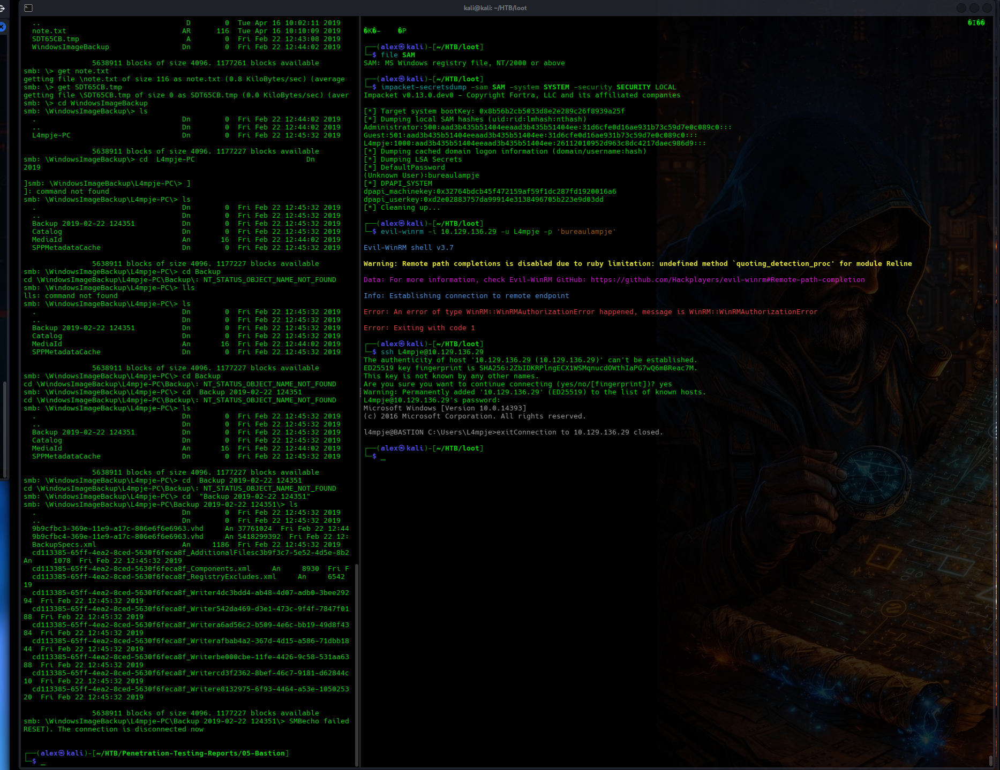

This demonstrated that authentication material exposed in the historical system backup remained valid against the live target.

---

### 8. User-Level Access Verification

The compromised account was verified using:

    whoami

The system returned:

    bastion\l4mpje

Local privilege and group information was reviewed, and the user proof was obtained.

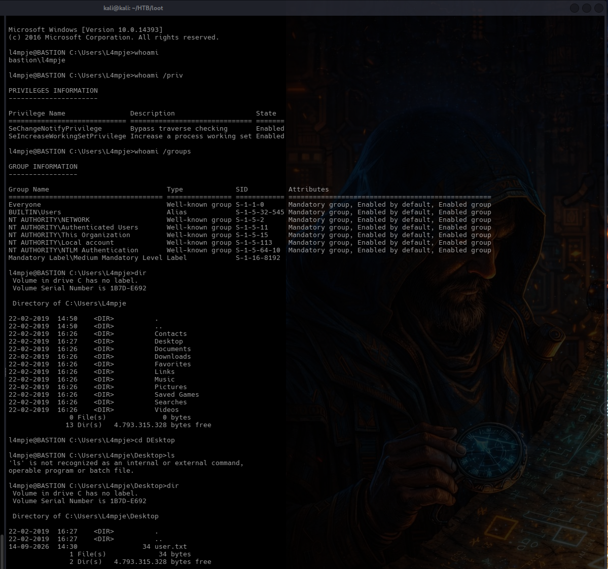

The next objective was to identify a path from the low-privileged `L4mpje` account to the local Administrator account.

---

### 9. Local Privilege Escalation Enumeration

WinPEAS was transferred to the target using SCP.

    scp winPEASx64.exe L4mpje@10.129.136.29:winPEASx64.exe

Because SSH access was already available, SCP provided a direct and reliable mechanism for transferring files to the target.

WinPEAS was then executed from the `L4mpje` profile.

    winPEASx64.exe

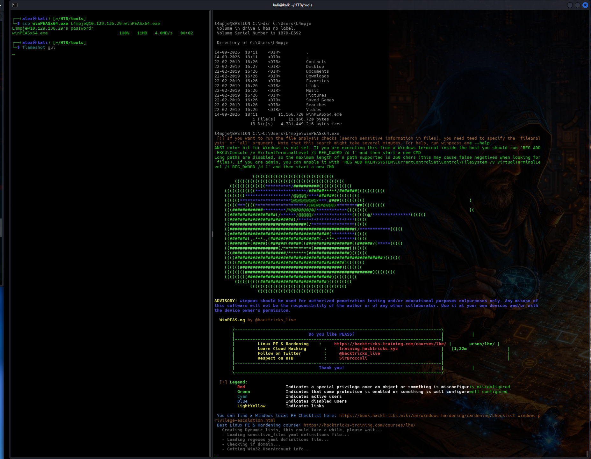

Automated enumeration did not immediately identify a direct privilege escalation vulnerability.

Manual inspection of installed applications was therefore continued using locations such as:

    C:\Program Files
    C:\Program Files (x86)

This eventually led to the discovery of the mRemoteNG remote connection manager.

---

### 10. DPAPI Credential Investigation

Local enumeration also revealed Windows DPAPI credential material belonging to the `L4mpje` user.

A credential file and corresponding DPAPI master key were identified and transferred to the attacker system for offline analysis.

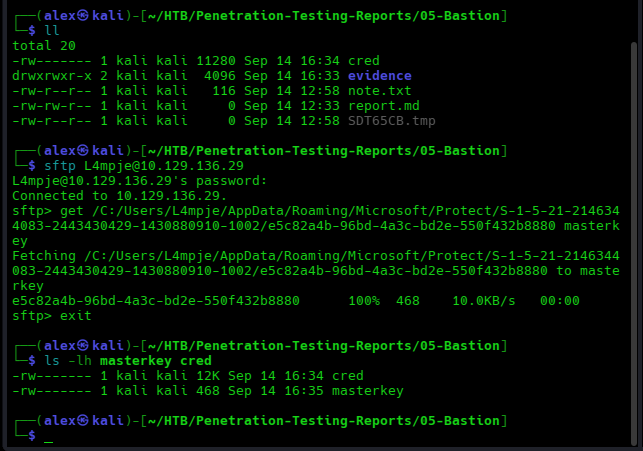

The master key could be decrypted using the known `L4mpje` password.

The associated credential file was also successfully processed.

However, the resulting data corresponded to a Windows Live persisted credential and did not provide a useful privilege escalation path.

The investigation therefore continued with installed third-party applications.

---

### 11. mRemoteNG Credential Discovery

Manual enumeration identified:

    C:\Program Files (x86)\mRemoteNG

mRemoteNG is a remote connection manager that can store and organize protocols such as RDP, SSH and VNC.

The application configuration belonging to the compromised user was located at:

    C:\Users\L4mpje\AppData\Roaming\mRemoteNG\confCons.xml

The file was inspected using:

    type "%APPDATA%\mRemoteNG\confCons.xml"

The XML configuration indicated that stored credentials were protected using:

    EncryptionEngine="AES"
    BlockCipherMode="GCM"
    KdfIterations="1000"

A saved connection named `DC` contained:

    Username="Administrator"
    Hostname="127.0.0.1"
    Protocol="RDP"

The `Password` field contained an encrypted value encoded as Base64.

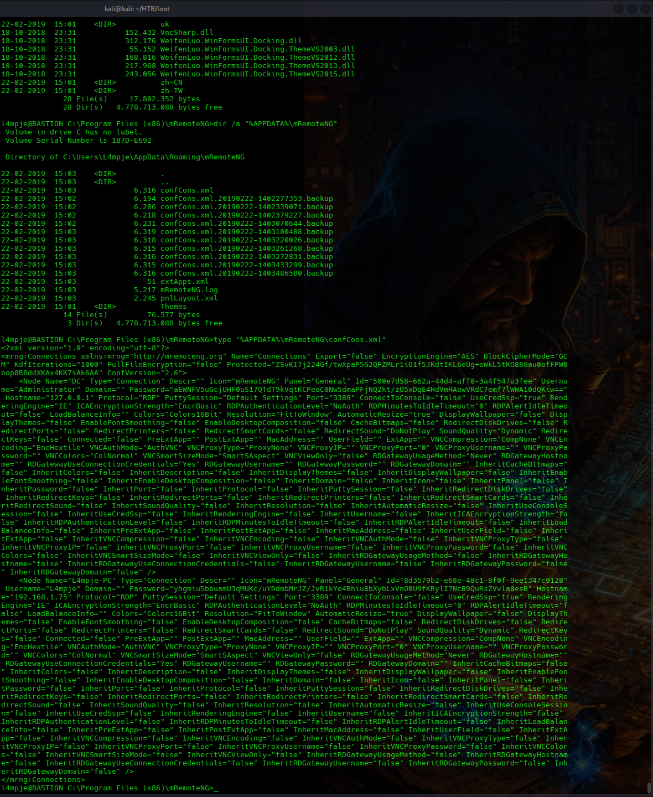

The password value was encrypted application credential data rather than an NTLM password hash.

Therefore, password cracking tools such as Hashcat or John were not the appropriate direct approach.

---

### 12. mRemoteNG Administrator Credential Decryption

The `confCons.xml` configuration file was transferred to the attacker system.

An mRemoteNG credential decryption utility was obtained:

    git clone https://github.com/gquere/mRemoteNG_password_decrypt

The configuration file was then processed using the supplied Python utility.

    python3 mremoteng_decrypt.py confCons.xml

The saved Administrator password was successfully decrypted.

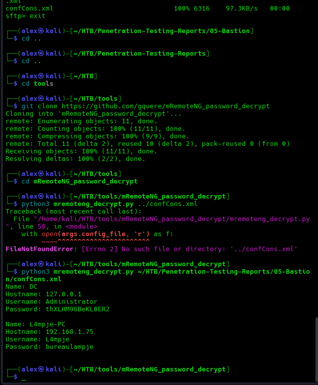

The recovered plaintext password provided valid credentials for the local Administrator account.

---

### 13. Administrator Access

The recovered Administrator credential was tested against the exposed SSH service.

    ssh Administrator@10.129.136.29

Authentication succeeded.

The current user was verified using:

    whoami

The system returned:

    bastion\administrator

This confirmed complete administrative compromise of the target.

The Administrator proof file was then accessed.

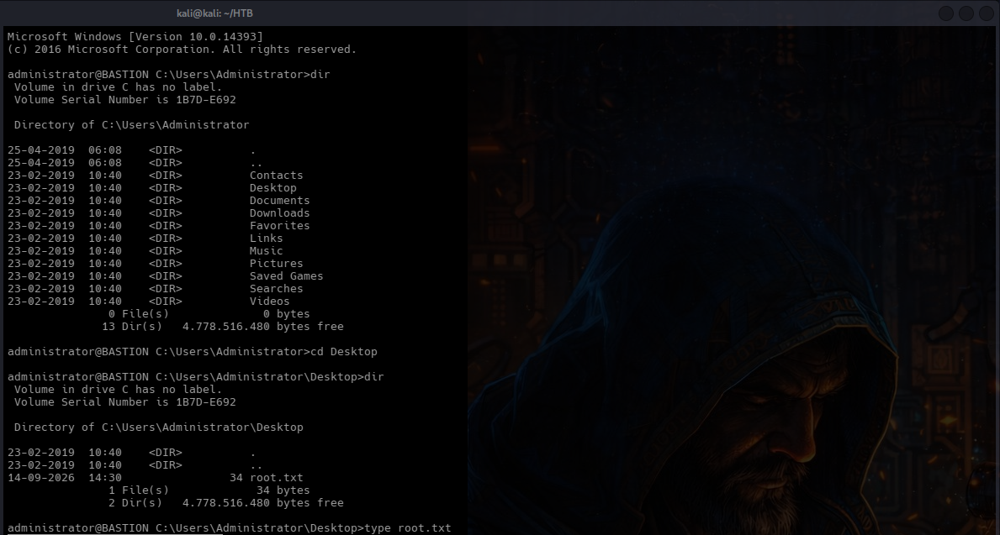

---

### Complete Attack Path

    Nmap enumeration
        ↓
    SMB service identified
        ↓
    Guest access to Backups share
        ↓
    WindowsImageBackup disclosure
        ↓
    VHD filesystem inspection
        ↓
    SAM / SYSTEM / SECURITY extraction
        ↓
    Offline secretsdump analysis
        ↓
    L4mpje credential recovery
        ↓
    SSH access as L4mpje
        ↓
    Local enumeration
        ↓
    mRemoteNG discovery
        ↓
    confCons.xml disclosure
        ↓
    Stored Administrator credential
        ↓
    mRemoteNG password decryption
        ↓
    Administrator SSH access
        ↓
    Complete system compromise

---

## Technical Findings

### BA-01 — Guest Access to Sensitive SMB Backup Share

**Severity:** High

**Affected Asset:** SMB service / `Backups` share

#### Description

The SMB service exposed a network share named `Backups` that could be accessed using guest authentication without valid user credentials.

The share contained sensitive Windows backup material belonging to the target environment.

#### Evidence

- `evidence/02-smb-share-enumeration.png`
- `evidence/03-backup-discovery.png`
- `evidence/04-vhd-files-discovery.png`

#### Impact

An unauthenticated attacker could access sensitive backup data remotely.

In this assessment, guest SMB access provided direct access to a Windows system backup that contained Registry hives and authentication material.

The exposed backup became the initial entry point for the complete compromise chain.

#### Root Cause

Sensitive backup data was stored on an SMB share whose access controls permitted guest access.

#### Recommendation

Disable guest and anonymous access to sensitive SMB shares.

Restrict backup shares to explicitly authorized administrative and backup service accounts.

Apply least-privilege access controls at both the SMB share and NTFS permission levels.

Monitor and audit access to repositories containing system backups.

---

### BA-02 — Windows System Backup Exposure

**Severity:** Critical

**Affected Asset:** `WindowsImageBackup`

#### Description

The exposed SMB share contained a Windows system image backup.

The backup included Virtual Hard Disk files representing the target's Windows filesystem.

Sensitive operating-system files could be accessed directly from the VHD, including:

    Windows/System32/config/SAM
    Windows/System32/config/SYSTEM
    Windows/System32/config/SECURITY

#### Evidence

- `evidence/03-backup-discovery.png`
- `evidence/04-vhd-files-discovery.png`
- `evidence/05-vhd-inspection.png`
- `evidence/06-registry-hives-extraction.png`

#### Impact

An attacker with access to the backup could retrieve highly sensitive historical system data without requiring access to the live operating system.

In this assessment, Registry hive extraction allowed local account hashes and LSA secrets to be recovered offline.

The disclosed authentication material directly enabled initial operating-system access.

#### Root Cause

A full Windows system backup containing sensitive operating-system and security data was stored in a location accessible to unauthorized network users.

#### Recommendation

Store system backups only in dedicated, access-controlled backup repositories.

Encrypt backup images using strong encryption with separately protected keys.

Prevent guest and standard user accounts from accessing operating-system backups.

Treat historical backups as sensitive security assets equivalent to the live system.

Regularly review backup permissions and ensure that expired or unnecessary backups are securely removed.

---

### BA-03 — Recoverable Credentials Within Historical Backup

**Severity:** Critical

**Affected Asset:** Windows Registry hives within system backup / `L4mpje` account

#### Description

The exposed Windows backup contained Registry hives that allowed authentication material to be recovered offline.

The `SAM` and `SYSTEM` hives exposed local account NTLM hashes.

The `SECURITY` hive also contained an LSA secret that disclosed a plaintext password associated with the `L4mpje` account.

The recovered password remained valid against the live target.

#### Evidence

- `evidence/06-registry-hives-extraction.png`
- `evidence/07-secretsdump-credentials.png`
- `evidence/08-l4mpje-ssh-access.png`
- `evidence/09-l4mpje-user-access.png`

#### Impact

An attacker with access to the backup could recover valid operating-system credentials without interacting with the live authentication subsystem.

In this assessment, the exposed password provided direct SSH access as `L4mpje`.

This converted an unauthenticated network-level vulnerability into authenticated operating-system access.

#### Root Cause

Historical backup data contained recoverable authentication secrets, and credentials present in the backup remained valid on the live system.

#### Recommendation

Rotate credentials whenever backup data containing authentication secrets may have been exposed.

Avoid storing recoverable plaintext credentials where possible.

Implement regular credential rotation so that historical backup credentials become invalid over time.

Restrict backup access and encrypt sensitive backup content.

Review Windows policies and applications that may cause credentials to be stored as LSA secrets.

---

### BA-04 — Stored Administrator Credential in mRemoteNG

**Severity:** Critical

**Affected Asset:** `C:\Users\L4mpje\AppData\Roaming\mRemoteNG\confCons.xml`

#### Description

The compromised `L4mpje` user profile contained an mRemoteNG configuration file with a saved connection using the local `Administrator` account.

The Administrator password was stored as encrypted application data in `confCons.xml`.

The stored value could be decrypted using publicly available mRemoteNG credential recovery tooling.

The recovered plaintext password was valid for the local Administrator account.

#### Evidence

- `evidence/12-mremoteng-credential-discovery.png`
- `evidence/13-mremoteng-password-decryption.png`
- `evidence/14-administrator-access.png`

#### Impact

Compromise of the low-privileged `L4mpje` account exposed a credential capable of authenticating as the local Administrator.

This immediately converted low-privileged operating-system access into full administrative control of the target.

An attacker with Administrator credentials could access all local files, modify system configuration, obtain additional credentials and fully control the server.

#### Root Cause

A highly privileged Administrator credential was stored within a connection-manager configuration accessible to a lower-privileged user.

The protection applied to the saved credential was insufficient to prevent offline recovery once the configuration file was obtained.

#### Recommendation

Do not store highly privileged credentials in user-controlled remote connection manager profiles unless strong master-password protection and appropriate access controls are enforced.

Use dedicated privileged access management solutions for administrative credentials.

Ensure administrative passwords are unique and rotated regularly.

Restrict access to connection-manager configuration files.

Where possible, use separate administrative identities and avoid storing reusable privileged passwords.

Immediately rotate any credential exposed through the affected configuration.

---

## Remediation Summary

1. **Disable guest access to the SMB `Backups` share immediately.** Restrict access to explicitly authorized administrative and backup identities.

2. **Protect Windows system backups as highly sensitive assets.** Store them only in dedicated, access-controlled repositories.

3. **Encrypt backup images at rest** and protect encryption keys separately from the backup data.

4. **Rotate all credentials exposed through historical backups**, including local account passwords and any secrets stored within Windows Registry hives.

5. **Implement regular credential rotation** so that authentication material contained in older backups cannot be used against live systems.

6. **Review Windows LSA secret storage** and remove unnecessary persisted credentials.

7. **Remove stored Administrator credentials from mRemoteNG** or protect them using strong master-password and privileged access controls.

8. **Use separate credentials for privileged administration** and avoid exposing Administrator passwords to standard user profiles.

9. **Review local application configuration files** for additional stored passwords, tokens or connection credentials.

10. **Monitor access to backup shares and credential-management configuration files** for suspicious activity.

---

## Limitations

The assessment was conducted against a single designated Hack The Box target within an authorized lab environment.

Testing focused on identifying and validating a practical attack path from unauthenticated external access to complete administrative compromise.

The assessment did not include:

- Denial-of-service testing
- Persistence mechanisms
- Destructive actions
- Testing of systems outside the designated target
- Long-term monitoring
- Social engineering

Sensitive flag values obtained during the assessment have intentionally been excluded from this public report.

Plaintext credentials should be redacted from public-facing screenshots and evidence where practical.

The DPAPI investigation documented during the assessment did not contribute directly to the final privilege escalation path but was retained as evidence of credential-focused post-exploitation enumeration.

---

## Conclusion

The Bastion host was fully compromised through a chain of weaknesses involving insecure backup exposure, recoverable historical credentials and insecure storage of privileged connection credentials.

Initial enumeration identified an SMB service that permitted guest access to the `Backups` share. The share contained a complete Windows system image backup.

The backup was mounted remotely and its VHD filesystem inspected. Sensitive Windows Registry hives were extracted and analysed offline using Impacket. This exposed authentication material belonging to `L4mpje`, including a password that remained valid against the live SSH service.

SSH access as `L4mpje` provided a low-privileged foothold on the Windows server.

Post-exploitation enumeration identified mRemoteNG and its `confCons.xml` configuration file. The file contained a saved connection using the local Administrator account and an encrypted password.

The saved Administrator password was successfully decrypted using an mRemoteNG credential recovery utility.

The recovered credential was valid for SSH authentication as Administrator, resulting in complete administrative compromise of the target.

The successful attack chain was:

    Guest SMB access
        ↓
    Windows backup disclosure
        ↓
    VHD filesystem access
        ↓
    Registry hive extraction
        ↓
    Offline credential recovery
        ↓
    SSH access as L4mpje
        ↓
    Local post-exploitation enumeration
        ↓
    mRemoteNG configuration discovery
        ↓
    Stored Administrator credential
        ↓
    Credential decryption
        ↓
    Administrator SSH access
        ↓
    Complete system compromise
