# Cascade Penetration Test Report

## Executive Summary

A black-box penetration test was conducted against the Cascade Windows domain controller hosted on Hack The Box.

The assessment resulted in full compromise of the target. Anonymous LDAP access exposed a custom Active Directory attribute named `cascadeLegacyPwd` on the `r.thompson` account. The value could be decoded into a valid password, which provided authenticated SMB access to the `Data` share.

The `Data` share contained internal notes, logs and a TightVNC registry export belonging to `s.smith`. The TightVNC password could be recovered and was reused as the Windows password for `s.smith`, providing WinRM access to the server.

Further enumeration showed that `s.smith` could read the `Audit$` share. The share contained an SQLite database with an encrypted password for the `ArkSvc` service account, together with the .NET application files used to process that credential. The required AES key and IV were recoverable from the application files, allowing the password to be decrypted and reused for WinRM access as `ArkSvc`.

`ArkSvc` was a member of the custom `AD Recycle Bin` group. This allowed the account to inspect deleted Active Directory objects. The deleted `TempAdmin` object still contained a `cascadeLegacyPwd` attribute, and internal documentation stated that `TempAdmin` used the same password as the normal Administrator account. Recovering this credential resulted in Administrator access and complete compromise of the domain controller.

The assessment demonstrated how exposed directory attributes, credential reuse, sensitive SMB data, reversible credential storage and excessive Active Directory permissions could be chained into full administrative compromise.

## Assessment Scope

| Item | Details |
|---|---|
| Target | Cascade |
| Platform | Hack The Box |
| Target IP | 10.129.59.233 |
| HTB hostname | cascade.htb |
| Active Directory domain | cascade.local |
| Windows computer name | CASC-DC1 |
| Operating System | Windows Server 2008 R2 SP1 |
| Assessment Type | Black-Box Penetration Test |
| Assessment Date | 19 September 2026 |

Testing was limited to the designated Hack The Box target.

## Methodology

The assessment followed a structured penetration-testing process covering reconnaissance, vulnerability identification, exploitation, post-exploitation enumeration and privilege escalation.

### Reconnaissance

Network enumeration was used to identify exposed Windows and Active Directory services.

Relevant services included:

- DNS
- Kerberos
- LDAP / LDAPS
- SMB
- Global Catalog LDAP
- WinRM

### Vulnerability Identification

LDAP and SMB were reviewed for unauthenticated or low-privilege information disclosure. Recovered files and application data were then examined for reusable credentials, configuration weaknesses and privilege-escalation opportunities.

### Exploitation

The assessment used exposed LDAP data to obtain the first valid domain credential. SMB access then revealed a TightVNC configuration containing a reversible password. This password was reused by `s.smith`, providing WinRM access.

The `Audit$` share later exposed an encrypted `ArkSvc` credential and the application components required to decrypt it.

### Post-Exploitation Enumeration

WinRM access was used to inspect account privileges, group memberships and available network resources.

### Privilege Escalation

`ArkSvc` membership in `AD Recycle Bin` allowed access to a deleted `TempAdmin` object. A preserved password attribute from that object matched the Administrator credential, resulting in full administrative access.

## Risk Rating

| Severity | Description |
|---|---|
| Critical | Vulnerabilities that can result in complete system or administrative compromise. |
| High | Vulnerabilities that expose sensitive credentials or provide significant unauthorized access. |
| Medium | Weaknesses that provide useful information or limited access and normally require additional conditions for significant compromise. |
| Low | Weaknesses with limited direct impact that may assist further reconnaissance or exploitation. |
| Informational | Security observations that do not represent an immediate vulnerability but may assist defensive improvement. |

## Findings Overview

| Finding ID | Finding | Severity |
|---|---|---|
| CA-01 | Anonymous LDAP Access Exposes a Reusable Password Attribute | High |
| CA-02 | Sensitive Operational Data and Credentials Exposed Through SMB | High |
| CA-03 | Reversible TightVNC Password and Credential Reuse | High |
| CA-04 | ArkSvc Credential Recoverable From the Audit Share | High |
| CA-05 | Deleted Active Directory Object Exposes Administrator Credential | Critical |

## Compromise Walkthrough

### 1. Initial Reconnaissance

The target was scanned with Nmap:

```bash
nmap -sS -sC -sV -O -Pn -p1-10000 -oN nmapscan.txt 10.129.59.233
```

Relevant services included:

```text
53/tcp    DNS
88/tcp    Kerberos
135/tcp   MSRPC
139/tcp   NetBIOS-SSN
389/tcp   LDAP
445/tcp   SMB
636/tcp   LDAPS
3268/tcp  LDAP Global Catalog
3269/tcp  LDAPS Global Catalog
5985/tcp  WinRM
```

The host identified itself as `CASC-DC1` in the `cascade.local` domain.

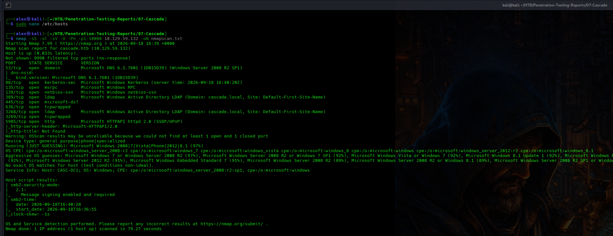

### 2. LDAP Enumeration

LDAP enumeration was possible without valid domain credentials. Domain users and their attributes were reviewed.

```bash
ldapsearch -x -H ldap://10.129.59.233 -b 'DC=cascade,DC=local' '(objectClass=user)' sAMAccountName
```

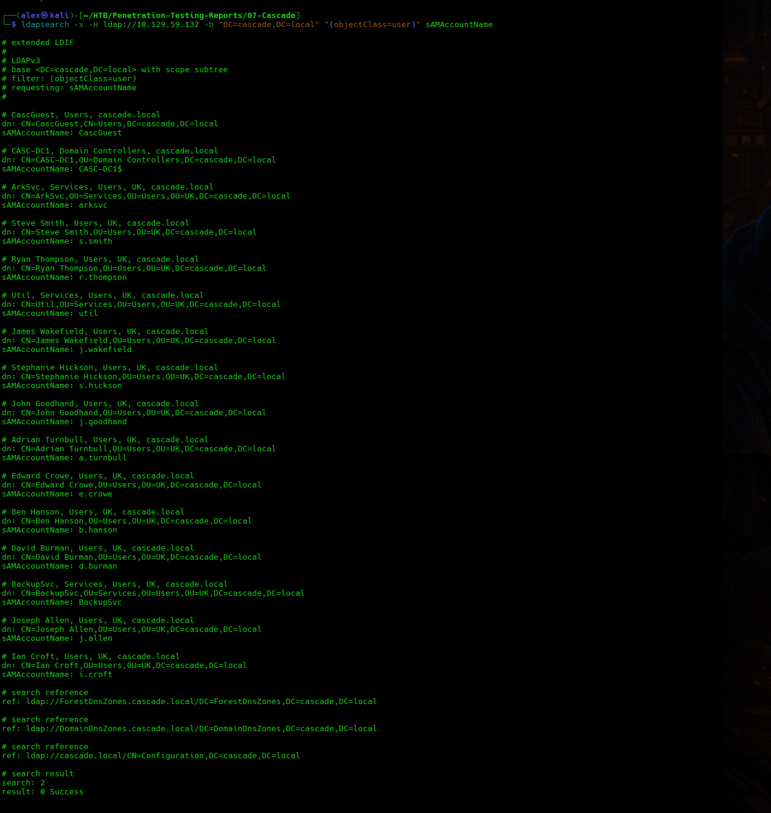

A more detailed query of `r.thompson` exposed the custom attribute:

```text
cascadeLegacyPwd
```

The value was Base64 encoded and could be decoded into a valid password. The recovered plaintext value is intentionally excluded from this public report.

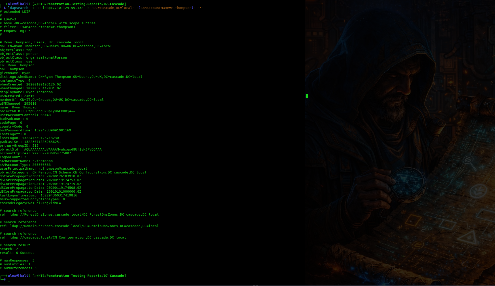

The decoded credential was validated against SMB.

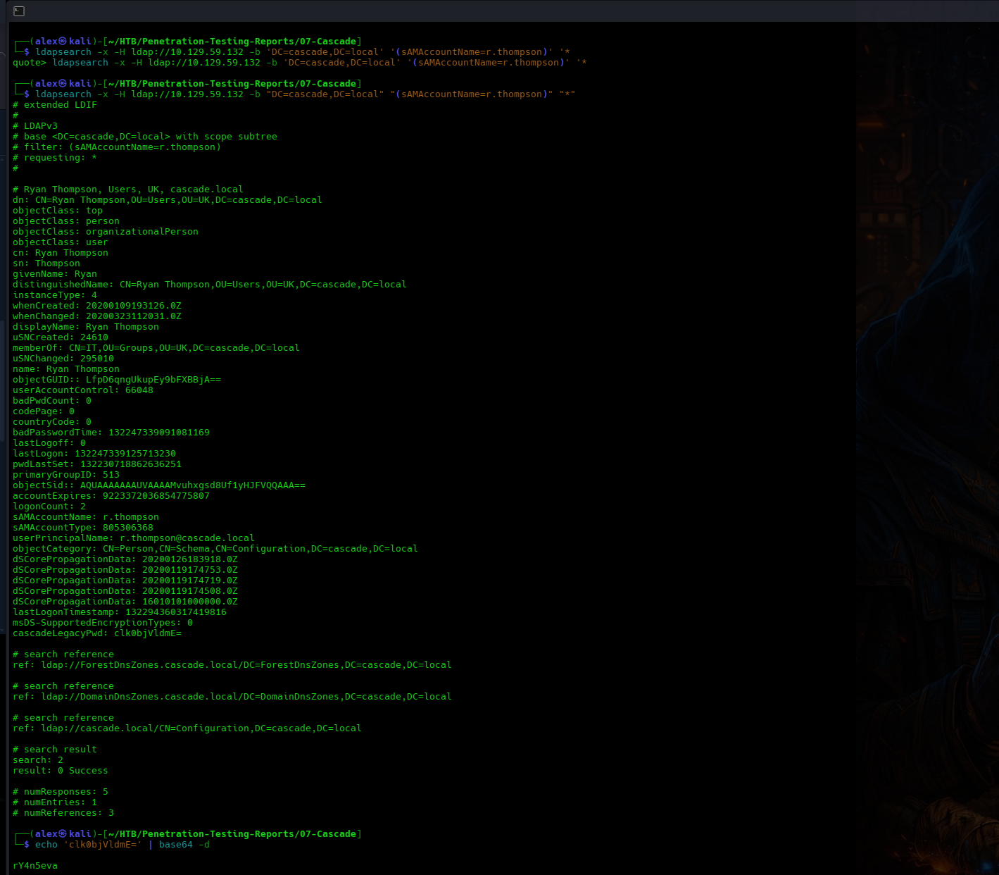

### 3. SMB Access as r.thompson

The recovered `r.thompson` credential was used to enumerate SMB shares:

```bash
nxc smb 10.129.59.233 -u 'r.thompson' -p '[redacted]' -d cascade.local --shares
```

The account had read access to several shares, including `Data`.

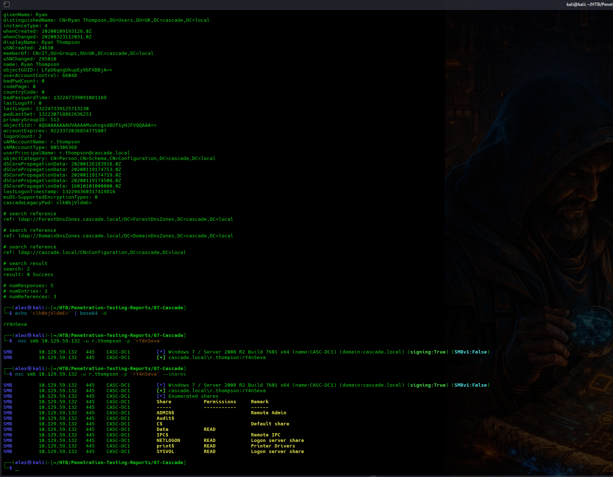

The `Data` share contained several business and IT directories.

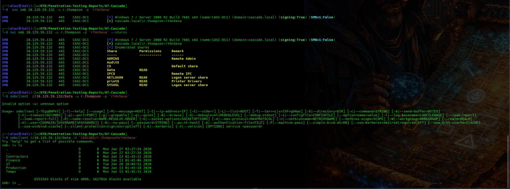

### 4. Sensitive Files in the Data Share

Enumeration of the `Data` share identified internal files relevant to the attack path, including:

```text
IT/Email Archives/Meeting_Notes_June_2018.html
IT/Logs/Ark AD Recycle Bin/ArkAdRecycleBin.log
IT/Logs/DCs/dcdiag.log
IT/Temp/s.smith/VNC Install.reg
```

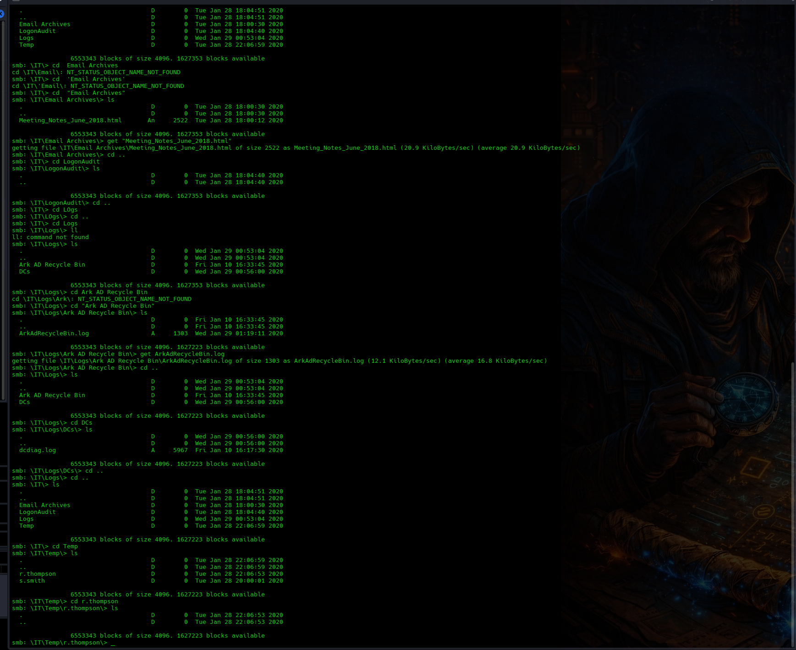

The meeting notes stated that a temporary account named `TempAdmin` used the same password as the normal Administrator account. This information became important later in the assessment.

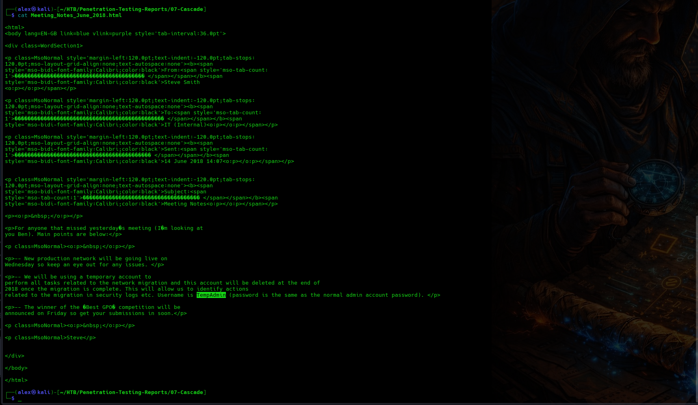

The `VNC Install.reg` file contained a TightVNC configuration for `s.smith`, including an obfuscated password value.

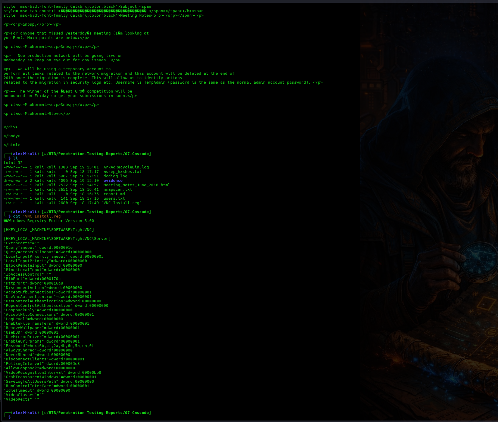

The VNC password was recovered using a TightVNC password-recovery utility. The plaintext credential is intentionally excluded from this report.

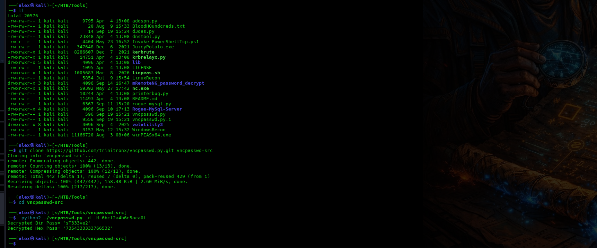

### 5. WinRM Access as s.smith

The recovered TightVNC password was reused by the Windows account `s.smith`.

```bash
evil-winrm -i 10.129.59.233 -u 's.smith' -p '[redacted]'
```

Authentication succeeded and provided an interactive PowerShell session.

Additional SMB enumeration confirmed that `s.smith` had access to shares not available to the earlier account.

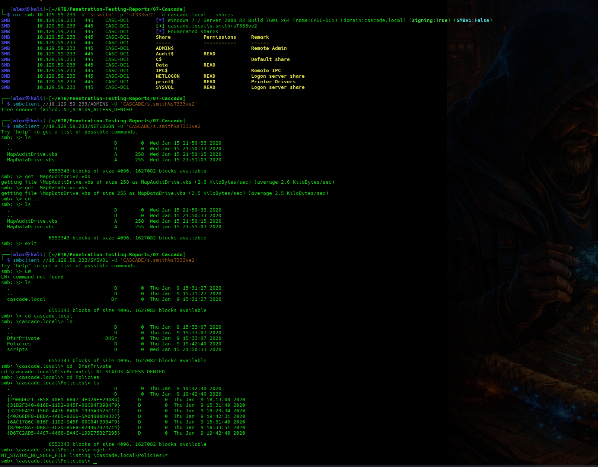

The user proof file was accessible from the `s.smith` Desktop.

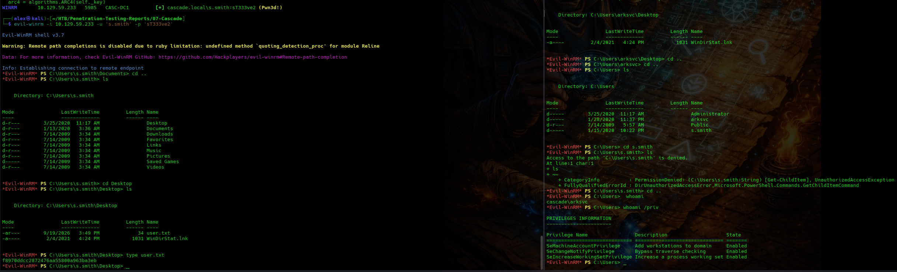

### 6. Audit Share Enumeration

The `s.smith` account had read access to the `Audit$` share.

```bash
smbclient //10.129.59.233/Audit$ -W CASCADE -U 's.smith%[redacted]'
```

The share contained application files and an SQLite database:

```text
CascAudit.exe
CascCrypto.dll
DB/Audit.db
RunAudit.bat
System.Data.SQLite.dll
System.Data.SQLite.EF6.dll
```

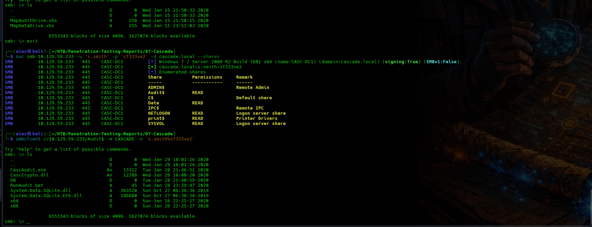

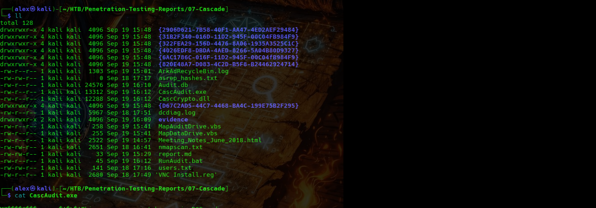

### 7. ArkSvc Credential Recovery

The `Ldap` table in `Audit.db` contained an encrypted credential for the `ArkSvc` service account.

```bash
sqlite3 Audit.db 'SELECT Id,uname,pwd,domain FROM Ldap;'
```

The encrypted value is intentionally omitted from this public report.

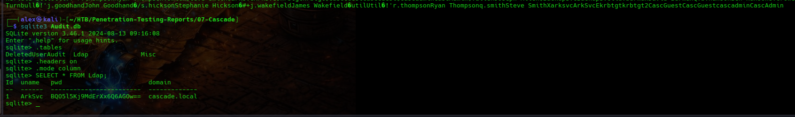

Static inspection of `CascAudit.exe` and `CascCrypto.dll` revealed the cryptographic material required by the application to decrypt the stored password.

The credential used AES-128-CBC. The exact ciphertext, key, IV and recovered plaintext password are intentionally excluded from this public report.

The decryption process followed this general form:

```bash
printf '[redacted-ciphertext]' | base64 -d > encrypted.bin
openssl enc -aes-128-cbc -d -in encrypted.bin -K '[redacted-key]' -iv '[redacted-iv]'
```

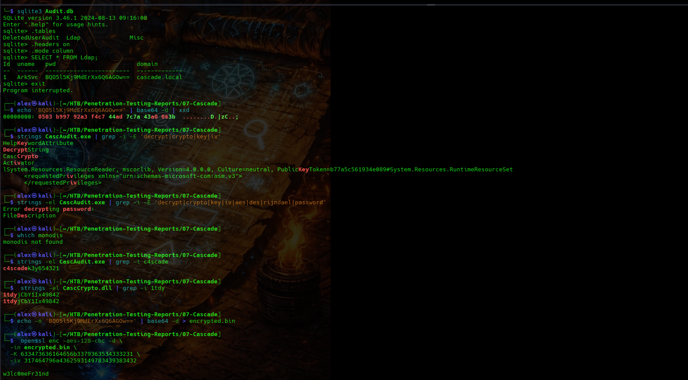

The recovered password successfully authenticated to WinRM as `ArkSvc`.

```bash
evil-winrm -i 10.129.59.233 -u 'ArkSvc' -p '[redacted]'
```

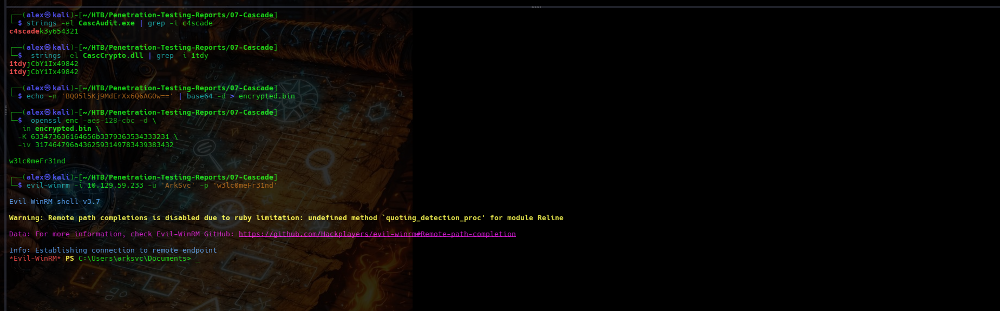

### 8. ArkSvc Privilege Enumeration

Group enumeration showed that `ArkSvc` was a member of several groups, including:

```text
CASCADE\AD Recycle Bin
CASCADE\Remote Management Users
CASCADE\IT
CASCADE\Data Share
```

The important group for the final escalation path was `AD Recycle Bin`.

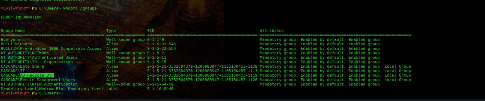

### 9. Deleted TempAdmin Object

Because of the `AD Recycle Bin` membership, deleted Active Directory objects could be queried with their preserved attributes.

```powershell
Get-ADObject -Filter 'samAccountName -eq "TempAdmin"' -IncludeDeletedObjects -Properties cascadeLegacyPwd
```

The deleted `TempAdmin` object retained the custom `cascadeLegacyPwd` attribute.

The value could be decoded into a plaintext password. The encoded and plaintext values are intentionally excluded from this public report.

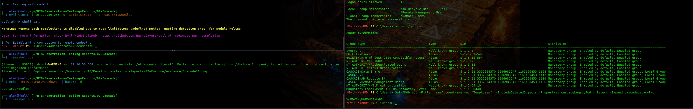

The previously recovered meeting note stated that `TempAdmin` used the same password as the normal Administrator account. The credential was therefore tested against the Administrator account.

### 10. Administrator Access

The recovered credential successfully authenticated through WinRM:

```bash
evil-winrm -i 10.129.59.233 -u 'Administrator' -p '[redacted]'
```

Administrator access and the root proof file confirmed complete compromise of the target.

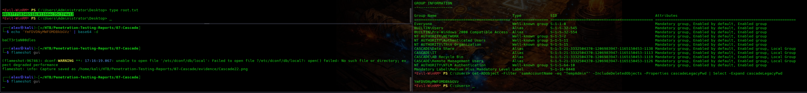

### Complete Attack Path

```text
Anonymous LDAP Enumeration
        ↓
r.thompson cascadeLegacyPwd Disclosure
        ↓
SMB Access to Data Share
        ↓
TightVNC Configuration Disclosure
        ↓
TightVNC Password Recovery and Credential Reuse
        ↓
s.smith WinRM Access
        ↓
Audit$ Share Access
        ↓
ArkSvc Encrypted Credential Recovery
        ↓
ArkSvc WinRM Access
        ↓
AD Recycle Bin Membership
        ↓
Deleted TempAdmin Object
        ↓
Administrator Credential Recovery
        ↓
Administrator WinRM Access
        ↓
Full Domain Controller Compromise
```

## Technical Findings

### CA-01 — Anonymous LDAP Access Exposes a Reusable Password Attribute

**Severity:** High

**Affected Asset:** LDAP service on TCP 389 / `r.thompson` Active Directory object

#### Description

The domain controller allowed LDAP queries without valid domain credentials. The `r.thompson` object contained a custom attribute named `cascadeLegacyPwd`.

The attribute stored a Base64-encoded password. Base64 only encodes data and does not provide cryptographic protection, so the value could be decoded directly into a usable password.

#### Evidence


#### Impact

An unauthenticated attacker could recover a valid domain credential. In this assessment, the credential provided SMB access and enabled further enumeration of sensitive internal data.

#### Root Cause

Sensitive credential material was stored in a directory attribute readable through anonymous LDAP queries.

#### Recommendation

Disable anonymous LDAP access where it is not required. Remove legacy password attributes from Active Directory and rotate any credentials exposed through them. Review directory permissions to ensure sensitive attributes are accessible only to authorized principals.

### CA-02 — Sensitive Operational Data and Credentials Exposed Through SMB

**Severity:** High

**Affected Asset:** `Data` SMB share

#### Description

The `Data` share was readable by a low-privileged domain account and contained internal meeting notes, logs and remote-access configuration files.

The files revealed information about privileged accounts, deleted Active Directory objects and a TightVNC password.

#### Evidence


#### Impact

A low-privileged domain user could obtain information and credentials that significantly increased access to the environment. The exposed files directly contributed to the compromise of `s.smith` and later helped identify the Administrator credential path.

#### Root Cause

Sensitive operational and credential-related information was stored in a broadly readable SMB location.

#### Recommendation

Apply least-privilege permissions to internal file shares. Remove passwords, credential material and privileged account information from shared directories. Review existing shares for historical sensitive data and monitor access to administrative files.

### CA-03 — Reversible TightVNC Password and Credential Reuse

**Severity:** High

**Affected Asset:** `VNC Install.reg` / `s.smith` account

#### Description

The TightVNC registry export contained a password stored using a reversible scheme. The value could be recovered using publicly available tooling.

The recovered VNC password was also reused as the Windows password for `s.smith`.

#### Evidence


#### Impact

An attacker with access to the configuration file could recover the VNC credential. Because the same password was reused for the Windows account, this resulted in interactive WinRM access to the server.

#### Root Cause

A remote-access password was stored in reversible form and reused for Windows authentication.

#### Recommendation

Do not reuse passwords across applications or Windows accounts. Remove obsolete remote-access configuration files from shared locations, rotate the affected credentials and use secure credential storage for remote-management applications.

### CA-04 — ArkSvc Credential Recoverable From the Audit Share

**Severity:** High

**Affected Asset:** `Audit$` share, `Audit.db`, `CascAudit.exe` and `CascCrypto.dll`

#### Description

The readable `Audit$` share contained an SQLite database with an encrypted password for the `ArkSvc` service account.

The same share also contained the .NET application files used to decrypt that password. Static inspection of the application exposed the cryptographic material required to recover the credential.

#### Evidence


#### Impact

An attacker with read access to the `Audit$` share could recover the `ArkSvc` password and obtain WinRM access as the service account.

This account provided the permissions required for the final privilege-escalation path.

#### Root Cause

An encrypted credential and the application material needed to decrypt it were stored together in a location accessible to a non-administrative user.

#### Recommendation

Do not store reusable service-account passwords in application databases. Use a managed secret-storage solution and ensure cryptographic keys are protected separately from encrypted data. Restrict access to `Audit$` and rotate the `ArkSvc` credential.

### CA-05 — Deleted Active Directory Object Exposes Administrator Credential

**Severity:** Critical

**Affected Asset:** Active Directory deleted-object container / `TempAdmin`

#### Description

`ArkSvc` was a member of the custom `AD Recycle Bin` group and could inspect deleted Active Directory objects.

The deleted `TempAdmin` object retained the `cascadeLegacyPwd` attribute. Internal documentation also stated that `TempAdmin` used the same password as the normal Administrator account.

This allowed the recovered TempAdmin password to be reused against the Administrator account.

#### Evidence


#### Impact

Compromise of the `ArkSvc` service account allowed recovery of an Administrator credential and resulted in complete compromise of the domain controller.

#### Root Cause

A service account had unnecessary access to deleted Active Directory objects, sensitive password data remained stored in a deleted object, and the temporary administrative password was reused by the Administrator account.

#### Recommendation

Remove unnecessary deleted-object access from service accounts. Do not store recoverable passwords in custom Active Directory attributes. Use unique passwords for temporary and privileged accounts, rotate the Administrator credential and review deleted objects for preserved secrets.

## Remediation Summary

1. Disable anonymous LDAP access where it is not required and remove legacy password attributes from Active Directory.
2. Rotate the credentials exposed during the assessment, including `r.thompson`, `s.smith`, `ArkSvc` and Administrator.
3. Restrict access to the `Data` and `Audit$` SMB shares using least privilege.
4. Remove sensitive notes, logs, registry exports and credential material from shared folders.
5. Prevent password reuse between remote-access applications, standard users, service accounts and administrators.
6. Store application secrets in an appropriate managed secret store rather than alongside application binaries.
7. Protect encryption keys separately from encrypted credentials.
8. Remove unnecessary `AD Recycle Bin` access from service accounts.
9. Review deleted Active Directory objects for preserved passwords or other sensitive attributes.
10. Restrict WinRM to authorized administrative users and management networks.

## Limitations

The assessment was performed against a single designated Hack The Box host in a controlled lab environment.

Testing focused on identifying and validating a practical attack path from unauthenticated network access to complete administrative compromise.

The assessment did not include:

- Denial-of-service testing
- Persistence mechanisms
- Destructive testing
- Malware deployment
- Social engineering
- Testing of systems outside the designated target
- Long-term monitoring

Sensitive flag values and recovered plaintext credentials have intentionally been excluded from this public report.

## Conclusion

The Cascade domain controller was fully compromised through a chain of weaknesses involving exposed directory data, credential reuse, sensitive SMB content, recoverable application credentials and excessive access to deleted Active Directory objects.

Anonymous LDAP enumeration exposed a reusable credential for `r.thompson`. SMB access then revealed a TightVNC credential that was reused by `s.smith`, providing WinRM access. The `Audit$` share exposed the encrypted `ArkSvc` credential together with the information needed to decrypt it. Finally, `ArkSvc` access to deleted Active Directory objects exposed a credential associated with `TempAdmin`, which was also valid for the Administrator account.

The successful attack chain was:

```text
Anonymous LDAP Enumeration
        ↓
r.thompson Credential Disclosure
        ↓
Data Share Access
        ↓
TightVNC Credential Recovery and Reuse
        ↓
s.smith WinRM Access
        ↓
Audit$ Share Access
        ↓
ArkSvc Credential Recovery
        ↓
ArkSvc WinRM Access
        ↓
AD Recycle Bin Access
        ↓
Deleted TempAdmin Object
        ↓
Administrator Credential Recovery
        ↓
Administrator WinRM Access
        ↓
Full Domain Controller Compromise
```

The assessment shows how several individually manageable weaknesses can combine into a complete compromise when credential exposure, password reuse and excessive access permissions exist in the same environment.
